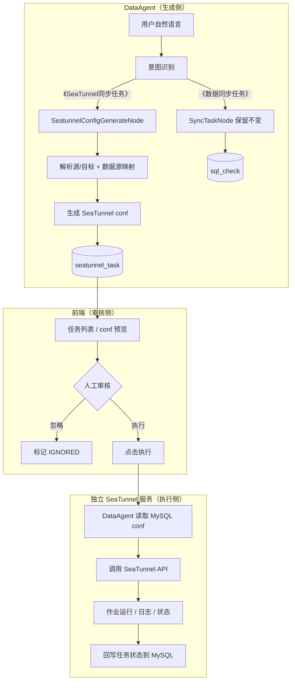
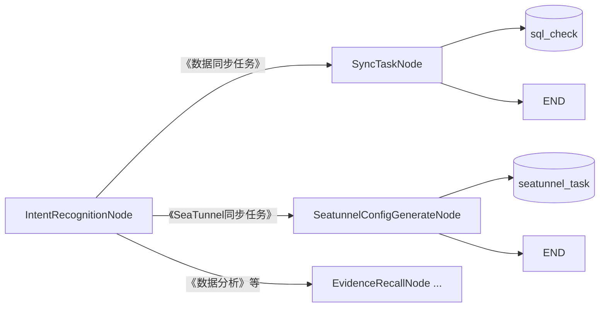
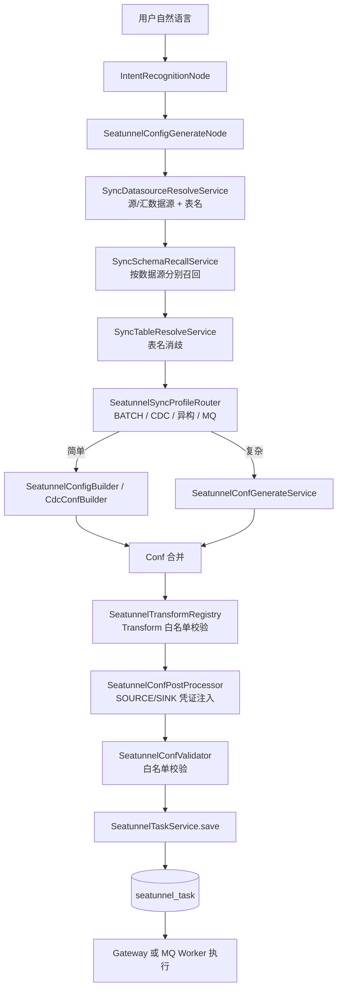

# DataAgent SeaTunnel 扩展路线（任务平台架构）

> 本文档描述 SeaTunnel 接入的**目标架构**：意图识别 → 生成 conf → 落库 → 页面人工审核 → 独立 SeaTunnel 服务执行。
> 与「DataAgent 内嵌 CLI、临时文件、Graph 内 Human Feedback」方案不同，本路线以**任务持久化 + 服务化执行**为核心。

## 核心思路（四步）



| 步骤 | 职责 | 落点 |
|------|------|------|
| **1. 意图识别扩展** | 新增《SeaTunnel同步任务》分类，路由到 conf 生成短链；现有《数据同步任务》仍走 `SyncTaskNode`，**互不影响** | `IntentRecognitionDispatcher` + 新建 `SeatunnelConfigGenerateNode` |
| **2. conf 落 MySQL** | 生成 HOCON/JSON 配置，写入任务表（含源/目标、状态、快照） | 新建 `seatunnel_task` 表 + Service |
| **3. 页面人工审核** | 列表展示 conf，支持预览、忽略、批准执行 | 前端任务中心页 |
| **4. 独立服务执行** | 审核通过后，DataAgent 读库并调用 SeaTunnel 服务 API 提交作业 | 独立部署的 SeaTunnel Gateway |

**设计原则：**

- **生成与执行解耦**：对话流只负责「理解 + 产出 conf」；执行是独立的 REST 动作，可跨会话、可隔天操作。
- **MySQL 为任务真相**：conf 快照、审批状态、外部 job_id、错误信息均持久化，可审计、可重试。
- **SeaTunnel 独立部署**：DataAgent 不安装 `seatunnel.sh`，不持有进程执行权限；通过 HTTP API 委托执行。

---

## 系统边界

```
┌─────────────────────┐     ┌─────────────────────┐     ┌─────────────────────┐
│   data-agent-       │     │       MySQL         │     │  SeaTunnel Gateway  │
│   management        │────▶│  seatunnel_task     │◀────│  (独立服务)          │
│                     │     │  (+ datasource 等)  │     │                     │
│  Graph: 意图→生成    │     └─────────▲───────────┘     │  POST /jobs         │
│  REST: 列表/执行/忽略 │               │                   │  GET  /jobs/{id}    │
└──────────▲──────────┘               │                   └──────────▲──────────┘
           │                           │                              │
┌──────────┴──────────┐               │                   ┌──────────┴──────────┐
│  data-agent-        │───────────────┘                   │  Apache SeaTunnel   │
│  frontend           │  审核页读列表、点执行               │  集群 / 本地安装     │
│  SeaTunnel 任务中心  │──────────────────────────────────▶│  seatunnel.sh       │
└─────────────────────┘  DataAgent 代理调用 Gateway         └─────────────────────┘
```

| 组件 | 负责 | 不负责 |
|------|------|--------|
| **DataAgent Graph** | 意图分流、解析表名、映射数据源、LLM/模板生成 conf、写任务表 | 直接调 `seatunnel.sh`、长期轮询作业 |
| **DataAgent REST** | 任务 CRUD、触发执行（读库 → 调 Gateway）、状态回写 | 渲染复杂审核 UI 以外的业务 |
| **MySQL** | conf 快照、PENDING/APPROVED/RUNNING/SUCCESS/FAILED/IGNORED | — |
| **前端** | 任务列表、conf 语法高亮预览、执行/忽略按钮、状态展示 | 生成 conf |
| **SeaTunnel Gateway** | 接收 conf、写临时 job 文件、调 CLI、返回 job_id、提供状态/日志查询 | 自然语言理解、数据源元数据 |

---

## 意图路由：方案 A（双链路并行，推荐）

**不修改**现有 `SyncTaskNode`，新建独立 Node 与意图分类，两条同步链路长期并存：

| 意图分类 | 路由目标 | 产出 | 审批表 | 执行方式 |
|---------|---------|------|--------|---------|
| `《数据同步任务》`（已有） | `SyncTaskNode` | MySQL 同步 SQL | `sql_check` | `SqlCheckService` 数据源直连执行 |
| `《SeaTunnel同步任务》`（新增） | `SeatunnelConfigGenerateNode` | SeaTunnel HOCON conf | `seatunnel_task` | `SeatunnelTaskService` 调 Gateway API |



**实施要点：**

- `intent-recognition.txt`：增加 `《SeaTunnel同步任务》` 定义与 few-shot，与 `《数据同步任务》` 区分（跨库大批量、需 SeaTunnel 引擎等场景走后者）。
- `Constant.java`：新增 `INTENT_CLASSIFICATION_SEATUNNEL_SYNC_TASK`、`SEATUNNEL_CONFIG_GENERATE_NODE` 等常量。
- `IntentRecognitionDispatcher`：在现有 `SYNC_TASK_NODE` 分支旁**新增** `SEATUNNEL_CONFIG_GENERATE_NODE` 分支；`SyncTaskNode` 相关代码零改动。
- `DataAgentConfiguration`：注册新 Node，`addConditionalEdges` 增加新路由；新 Node 完成后直接 `END`。

---

## 与现有代码的关系

项目里已有一套**高度相似**的 SQL 审批链路，作为 SeaTunnel 任务的**实现模板**（复制模式，不替换原链路）：

| 已有能力（保留不变） | 路径 | SeaTunnel 新建对应 |
|-------------------|------|-------------------|
| 意图 → SQL 同步分支 | `IntentRecognitionDispatcher` → `SyncTaskNode` | **不动**；另增 → `SeatunnelConfigGenerateNode` |
| SQL 审批表 | `sql_check` 表 | 新建 `seatunnel_task` 表 |
| SQL 持久化 + 执行 | `SqlCheckService` | `SeatunnelTaskService` |
| SQL REST API | `SqlCheckController` `/api/sql-check` | `SeatunnelTaskController` `/api/seatunnel-task` |
| SQL 前端审核页 | `SqlApproval.vue` + `sqlCheck.ts` | `SeatunnelTask.vue` + `seatunnelTask.ts` |

`SyncTaskNode` 继续生成 **MySQL 同步 SQL** 并写入 `sql_check`；新建的 `SeatunnelConfigGenerateNode` 负责生成 **SeaTunnel HOCON conf** 并写入 `seatunnel_task`。`SqlCheckService.execute()` 保持数据源直连执行；SeaTunnel 执行走**外部 Gateway API**。

`SeatunnelConfigGenerateNode` 可复用 `TableSyncService` 中「解析源/目标表、校验表是否存在」等逻辑，但**不继承、不修改** `SyncTaskNode` 类本身。

`CliExecutorService` / `CliEchoNode` 可作为**本地开发验证**工具保留，但**不是生产执行路径**。

---

## 可扩展功能清单

### 第一梯队：必做（主链路）

| # | 扩展项 | 说明 |
|---|--------|------|
| **1** | **意图识别扩展（方案 A）** | `intent-recognition.txt` 新增《SeaTunnel同步任务》；`IntentRecognitionDispatcher` 新增分支 → `SeatunnelConfigGenerateNode`；`《数据同步任务》` → `SyncTaskNode` 保持不变 |
| **2** | **独立短链（跳过 NL2SQL）** | 《SeaTunnel同步任务》不进 Schema/Planner/Feasibility，省 token、降延迟 |
| **3** | **数据源 → Connector 映射** | 复用 `Datasource` + `DatasourceTypeHandler`，生成 source/sink JDBC 片段 |
| **4** | **新建 conf 生成 Node** | `SeatunnelSyncComplexityRouter` 分流：简单场景走 `SeatunnelConfigBuilder` 模板，复杂场景走 `SeatunnelConfGenerateService`（LLM + Schema 召回 + 凭证注入）；**不修改** `SyncTaskNode` |
| **5** | **MySQL 任务表** | `seatunnel_task`：conf 全文、源/目标表、数据源 ID、状态、外部 job_id、错误信息 |
| **6** | **任务 Service + REST** | 保存、列表、执行、忽略；执行时读 conf 调 Gateway |
| **7** | **前端审核页** | 列表 + conf 预览 + 执行/忽略（参考 `SqlApproval.vue`） |
| **8** | **SeaTunnel Gateway（独立服务）** | 暴露提交/查询 API；内部写临时 conf 并调 `seatunnel.sh` |

### 第二梯队：生产必备

| # | 扩展项 | 说明 |
|---|--------|------|
| **9** | **执行状态同步** | Gateway 回调或 DataAgent 轮询 `GET /jobs/{id}`，更新 `seatunnel_task.exec_status` |
| **10** | **日志展示** | 前端展示 stdout/stderr 或 Gateway 提供的日志片段 |
| **11** | **配置项** | `spring.ai.alibaba.data-agent.seatunnel-gateway.*`：base-url、超时、鉴权 |
| **12** | **安全** | Gateway API Key；conf 中数据源密码脱敏展示；执行权限校验 |

### 第三梯队：体验增强（后期）

| # | 扩展项 | 说明 |
|---|--------|------|
| **13** | **MCP Tool** | `submitSyncTask` / `listSeatunnelTasks`，供外部 Agent 调用 |
| **14** | **对话内提示** | SSE 流告知「已生成 conf，请到任务中心审核」，不必在 Graph 内阻塞等人 |
| **15** | **Plan 集成（可选）** | 「先分析再同步」场景：`SEATUNNEL_TASK_NODE` 进 `PlanExecutorNode` |
| **16** | **Connector 扩展** | PostgreSQL、Kafka 等，复用 `DatasourceTypeHandler` 插件模式 |
| **17** | **重试 / 历史** | 失败任务一键重提；按 job_id 查历史运行 |

---

## 推荐实践路线（4 个阶段）

### 阶段 0：熟悉现有审批模式（0.5～1 天）

跟通现有 SQL 审批链路（即 SeaTunnel 任务的蓝本）：

- `SyncTaskNode` → `SqlCheckService.save()` → `sql_check` 表
- `SqlCheckController` → `SqlApproval.vue` → 执行/忽略
- `GraphServiceImpl` SSE 与 `IntentRecognitionDispatcher` 路由

**产出：** 明确「在现有 SQL 链路旁**并行新建** SeaTunnel 链路」要新增哪些类；`SyncTaskNode` 不在改动范围内。

---

### 阶段 1：意图识别 + conf 生成 + 落库（5～7 天）

```
扩展 intent-recognition.txt              # 新增《SeaTunnel同步任务》（与《数据同步任务》区分）
Constant.java                            # INTENT_CLASSIFICATION_SEATUNNEL_SYNC_TASK、SEATUNNEL_CONFIG_GENERATE_NODE
IntentRecognitionDispatcher              # 新增分支 → SeatunnelConfigGenerateNode；SyncTaskNode 分支不动
DataAgentConfiguration                   # 注册新 Node + 条件边；新 Node → END
SeatunnelConfigBuilder                   # 简单场景：同库 MySQL 全表 SELECT * 模板
SeatunnelSyncComplexityRouter            # 简单/复杂分流（无关联表 + 目标表存在 + 无过滤语义 → 模板，否则 LLM）
SeatunnelConfGenerateService             # 复杂场景：Schema + LLM 生成 HOCON（占位符）+ PostProcessor 注入凭证
SeatunnelConfigGenerateNode              # 新建 Node（参考 SyncTaskNode 结构，生成 conf 而非 SQL）
seatunnel_task 表 + Entity + Mapper
SeatunnelTaskService.save()              # 参考 SqlCheckService.save()
SeatunnelConfigGenerateNodeTest          # 单元测试
IntentRecognitionDispatcherTest          # 补充《SeaTunnel同步任务》路由用例
```

**建议表结构（`seatunnel_task`）：**

```sql
-- 字段示意，实施时写入 schema.sql
id, agent_id, source_datasource_id, sink_datasource_id,
source_table, target_table, job_config TEXT,          -- SeaTunnel conf 全文
exec_status,           -- PENDING / RUNNING / SUCCESS / FAILED / IGNORED
external_job_id,       -- Gateway 返回的作业 ID
error_msg, create_time, exec_time, update_time
```

**验收：**

- 输入「用 SeaTunnel 把 orders 同步到 orders_backup」→ 走模板路径（`generationMode=TEMPLATE`），conf 含 `SELECT * FROM orders`。
- 输入「将 a 和 c 聚合后同步到 b」或「排除 status=0」→ 走 LLM 路径（`generationMode=LLM`），conf 含自定义 query/transform，凭证由后处理注入。
- 输入「用 SeaTunnel 把 A 库 orders 同步到 B 库」→ 意图识别为《SeaTunnel同步任务》→ 走 `SeatunnelConfigGenerateNode` → `seatunnel_task` 出现一条 `PENDING` 记录。
- 输入同类 SQL 同步诉求 → 仍识别为《数据同步任务》→ `SyncTaskNode` → `sql_check`，行为与改动前一致。

**SIMPLE 判定规则（`SeatunnelSyncComplexityRouter`）：** 无关联表、目标表已存在、用户输入未命中过滤/JOIN/CDC 等复杂语义 → 模板；否则 LLM。

---

### 阶段 2：前端审核页（3～5 天）

```
SeatunnelTaskController    # GET /list, POST /{id}/execute, POST /{id}/ignore
seatunnelTask.ts           # 参考 sqlCheck.ts
SeatunnelTask.vue          # 参考 SqlApproval.vue：conf 语法高亮、状态筛选
路由 /seatunnel-task       # 菜单入口「SeaTunnel 任务」
```

**验收：**

- 页面能列出待审核任务、预览 conf 全文、忽略无效任务。
- 此阶段「执行」可先 Mock（仅改状态），或对接阶段 3 的 Gateway。

---

### 阶段 3：独立 SeaTunnel Gateway + 执行闭环（5～7 天，⏸️ 非当前 MVP）

> **前置：** P0 conf 生成与审核落库已完成。本阶段需**单独部署** SeaTunnel Gateway 服务，与 DataAgent 解耦。

**Gateway 服务（新建独立模块或仓库）：**

```
POST /api/jobs          # body: { config: "..." } 或 { taskId, config }
GET  /api/jobs/{jobId}  # 返回 status、exitCode、stdout/stderr 摘要
```

Gateway 内部：写临时 `*.conf` → `ProcessBuilder` 调 `seatunnel.sh -m local -c <file>` → 返回 job_id。

**DataAgent 侧：**

```
SeatunnelGatewayClient           # RestTemplate / WebClient 调 Gateway
SeatunnelTaskService.execute()   # 读 seatunnel_task.job_config → POST Gateway → 更新 RUNNING
SeatunnelTaskStatusPoller        # 定时或手动刷新：GET job 状态 → 回写 SUCCESS/FAILED
spring.ai.alibaba.data-agent.seatunnel-gateway.base-url
```

**验收：**

- 审核页点击「执行」→ Gateway 提交作业 → 任务状态变为 SUCCESS/FAILED，错误信息可查。
- DataAgent 机器上**无需**安装 SeaTunnel（仅 Gateway 机器需要）。

---

### 阶段 4：生产化打磨（5～10 天）

```
鉴权（Gateway API Key、执行人校验）
日志页 / 执行详情抽屉
失败重试、并发控制（同一任务不可重复执行）
MCP Tool（可选）
监控与告警（可选）
```

**验收：** 自然语言 → conf 落库 → 人工审核 → 远程执行 → 状态可追溯，全链路可用于内网试运行。

---

## Connector 能力实现阶段（Source → Sink）

> 上文「阶段 0～4」聚焦**平台工程**（意图、审核、Gateway）；本节聚焦 **Connector 能力**按 Source → Sink 组合的演进路线。
> 目标不是覆盖 [SeaTunnel 全部 Source/Sink Connector](https://seatunnel.apache.org/zh-CN/docs/2.3.13/connectors/source)，而是**白名单式**渐进支持企业常用组合。
>
> **每个阶段（P0～P4）均包含：** ① 实现目标 ② 实现方案思路 ③ 测试方案。

### 实现总原则

| 原则 | 说明 |
|------|------|
| **白名单制** | 只实现企业常用 Source → Sink 组合；新增组合须注册到 `SeatunnelConnectorRegistry` |
| **生成 ≠ 执行** | Agent 生成 conf 文本；Worker/Gateway 须安装对应 Connector JAR 才能真正跑作业 |
| **与 SQL 链路分工** | 同库小表轻量同步仍走 `SyncTaskNode`；SeaTunnel 负责跨源、大批量、CDC、异构 |
| **执行通道可演进** | 近期 HTTP Gateway；中期 **MQ + SeaTunnel Worker**；长期多 Worker 队列调度 |
| **LLM 边界** | JDBC 复杂 query 用 LLM；**列映射/行过滤**等走 P1 Transform 白名单；CDC/MQ 连接信息宜模板/配置注入 |
| **凭证安全** | conf 落库可含真实连接信息；审核页脱敏展示；MQ 消息体不传全文 conf |

### 阶段代号与依赖关系

| 代号 | 含义 | 前置依赖 |
|------|------|----------|
| **P0** ✅ | 当前 MVP 完善（MySQL 同库 Jdbc BATCH，**conf 生成 + 审核落库**） | 平台阶段 1 + 2（conf 生成、Schema 对齐、审核预览） |
| **P1** | JDBC 跨源批同步 + **常用 Transform 白名单** | P0 + 平台阶段 3（Gateway 执行闭环） |
| **P2** | 异构批同步 + 数仓/OLAP Sink | P1 |
| **P3** | CDC / 增量 / 流式 | P1 + Gateway/Worker 长作业能力 |
| **P4** | 消息队列 / 文件 / 扩展拓扑 | P1；部分组合依赖 P3 |

图例：**NL** = 支持自然语言生成 conf；**Exec** = 执行侧需安装的 SeaTunnel Connector 插件。

### 共性架构（P1 起逐步落地）



| 组件 | 职责 | 现有 / 新建 |
|------|------|-------------|
| `SeatunnelConnectorRegistry` | 注册允许的 Source/Sink Connector 及 SyncProfile | **新建** |
| `SeatunnelConnectorAdapter` | `Datasource` → HOCON source/sink 片段 | **新建**（P1） |
| `SyncDatasourceResolveService` | NL → sourceDsId / sinkDsId | **新建**（P1） |
| `SeatunnelSyncProfileRouter` | 演进自 `SeatunnelSyncComplexityRouter` | **改造** |
| `SeatunnelConfPostProcessor` | 双端占位符注入 | **改造**（P1） |
| `SeatunnelConfValidator` | 黑名单 → 白名单 + Profile 规则 + Transform 校验 | **改造** |
| `SeatunnelTransformRegistry` | 注册允许的 Transform 插件及 NL 触发关键词 | **新建**（P1） |
| `CdcConfBuilder` | MySQL-CDC / PG-CDC 模板 | **新建**（P3） |
| `ConnectorProfile` 实体 | Kafka topic、S3 bucket 等非 JDBC 配置 | **新建**（P4） |

---

### P0｜当前 MVP 完善（MySQL 同库 Jdbc BATCH）✅ 已完成

> **P0 验收范围（已完成）：** 自然语言 → 合法 HOCON conf 生成与审核落库。**执行闭环**（独立 SeaTunnel Gateway、状态轮询、exec 日志）依赖平台 [阶段 3](#阶段-3独立-seatunnel-gateway--执行闭环57-天)，**不在 P0 交付范围**。

#### 1. 实现目标

**业务目标**

- 用户说「用 SeaTunnel 把 orders 同步到 orders_backup」，系统能生成合法 HOCON conf、写入 `seatunnel_task`、在审核页**预览 conf**。
- 简单全表同步走**模板**（低延迟、无 LLM 幻觉）；含 JOIN/过滤/关联表走 **LLM** 路径。
- 与 SQL 链路意图分流清晰：《数据同步任务》→ SQL；《SeaTunnel同步任务》→ conf。
- 审核页「执行」为预留能力；真跑作业需后续部署独立 Gateway（见阶段 3）。

**技术目标**

| 目标项 | 当前状态 | P0 完成标准 |
|--------|----------|-------------|
| 意图路由 | ✅ 已实现 | Intent → Evidence → QueryEnhance → `SeatunnelConfigGenerateNode` |
| conf 生成 | ✅ 已实现 | 模板 + LLM；JOIN/WHERE 正确写入 `source.Jdbc.query`（`docs/缺陷.md` 已修复） |
| 表名解析 | ✅ 已实现 | 独立轨：`SeatunnelSchemaRecallService` + `SeatunnelTableResolveService` + `SeatunnelRelatedTableExpander` |
| 任务落库 | ✅ 已实现 | `seatunnel_task`；同库时 `sourceDatasourceId` / `sinkDatasourceId` 相同 |
| 审核预览 | ✅ 已实现 | 列表、conf 全文预览、忽略无效任务 |
| 审核执行 | ⏸️ 暂缓 | 依赖独立 Gateway；见 [阶段 3](#阶段-3独立-seatunnel-gateway--执行闭环57-天)（非 P0） |
| Connector 范围 | ✅ 已实现 | Validator 禁止 Kafka/CDC/STREAMING |

**Source → Sink 矩阵**

| # | Source | Sink | 模式 | NL | Exec 插件 |
|---|--------|------|------|-----|-----------|
| 0.1 | Jdbc (MySQL) | Jdbc (MySQL) | BATCH | ✅ 模板 | connector-jdbc |
| 0.2 | Jdbc (MySQL) | Jdbc (MySQL) | BATCH | ✅ LLM | connector-jdbc |

#### 2. 实现方案思路

**2.1 表名与 Schema 对齐（✅ 已完成）**

```
SeatunnelSyncService.generateConf()
  ├─ SeatunnelSchemaRecallService.recall(datasourceId, agentId, recallQuery)
  ├─ SeatunnelTableResolveService.resolve(recallQuery, multiTurn, schema, evidence)
  ├─ SeatunnelRelatedTableExpander.expand(...)
  └─ 已废弃 sync-intent-parse 主路径
```

- Graph：`IntentRecognitionNode` → `EvidenceRecallNode` → `QueryEnhanceNode` → `SeatunnelConfigGenerateNode`（与 SQL 同步轨前半段对齐，Schema 服务独立隔离）。
- `SeatunnelConfigGenerateNode` 从 state 读取 `INPUT_KEY`、`MULTI_TURN_CONTEXT`、`CANONICAL_QUERY`、`evidence`。

**2.2 模板 / LLM 分流（保持现有逻辑，修 Prompt）**

- `SeatunnelSyncComplexityRouter`：有关联表 / 过滤语义 / 目标表不存在 → LLM。
- 更新 `seatunnel-conf-generate.txt`：强调 WHERE 必须出现在 query 中；JOIN 表必须在 query 内连接。
- `SeatunnelConfValidator`：校验 query 非空（LLM 路径）、禁止 STREAMING。

**2.3 执行闭环（⏸️ 暂缓，平台阶段 3）**

> 需独立部署 SeaTunnel Gateway 服务；当前 MVP 以 **conf 生成正确性** 为验收标准，以下项不在 P0 交付范围。

- `SeatunnelTaskService.execute()`：提交后保持 RUNNING、禁止 submit 成功即 SUCCESS。
- `SeatunnelGatewayClient.getJobStatus()` + `SeatunnelTaskStatusPoller`：轮询 `GET /api/jobs/{id}` → 回写 SUCCESS/FAILED + `error_msg`。
- `SeatunnelTask.vue`：展示 `externalJobId`、exec 日志、RUNNING 自动刷新。
- 配置项：`spring.ai.alibaba.data-agent.seatunnel-gateway.*`（已有占位，Gateway 未部署时 execute 可不可用）。

**2.4 涉及类（P0 改动清单）**

| 类 / 文件 | 状态 |
|-----------|------|
| `SeatunnelSyncService` | ✅ 接入独立 Recall / Resolve / Expander |
| `SeatunnelConfigGenerateNode` | ✅ 传递 canonicalQuery / evidence |
| `DataAgentConfiguration` | ✅ SeaTunnel 经 Evidence + QueryEnhance |
| `seatunnel-conf-generate.txt` | ✅ JOIN + WHERE 约束 |
| `SeatunnelConfValidator` | ✅ query 非空、过滤语义 WHERE 校验 |
| `SeatunnelTaskService` / `SeatunnelTaskStatusPoller` / exec 前端 | ⏸️ 阶段 3 |

#### 3. 测试方案

**3.1 单元测试（Mock，不依赖 LLM/DB/Gateway）**

| 测试类 | 用例要点 |
|--------|----------|
| `SeatunnelSyncComplexityRouterTest` | 模板/LLM 边界：有关联表、含「排除」、CDC 关键词 |
| `SeatunnelConfigBuilderTest` | 输出含 env/source/sink；query 为 `SELECT *`；凭证来自 DbConfig |
| `SeatunnelConfValidatorTest` | 缺块报错；含 Kafka/STREAMING 拒绝 |
| `SeatunnelConfPostProcessorTest` | 占位符替换、HOCON 转义 |
| `SeatunnelConfGenerateServiceTest` | Mock LLM 返回 → validate 通过；含 Kafka 拒绝 |
| `SeatunnelSyncServiceTest` | 模板路径不调 LLM；LLM 路径调 generateService；表不存在返回 error |
| `SeatunnelTableResolveServiceTest` | 业务名「订单明细」→ `order_items` |
| `SeatunnelSchemaRecallServiceTest` | 独立 TopK / 阈值 |
| `SeatunnelConfigGenerateNodeTest` | Node 输出流 + save 被调用 |
| `IntentRecognitionDispatcherTest` / `QueryEnhanceDispatcherTest` | SeaTunnel 路由正确 |

**3.2 集成测试（Testcontainers / H2）**

| 场景 | 验证点 | 状态 |
|------|--------|------|
| 保存任务 | `SeatunnelTaskService.save()` → `seatunnel_task` 有 PENDING 记录 | 可选补充 |
| 表名校验 | 对接 H2 schema，源表不存在时返回明确错误 | 可选补充 |
| 执行 Mock Gateway | WireMock 模拟 Gateway 提交与状态轮询 | ⏸️ 阶段 3 |

**3.3 端到端 / 手工验收**

| # | 输入 | 预期 | 状态 |
|---|------|------|------|
| E2E-0.1 | 「用 SeaTunnel 把 orders 同步到 orders_backup」 | `generationMode=TEMPLATE`；conf 含 `SELECT * FROM orders`；`seatunnel_task` PENDING | ✅ |
| E2E-0.2 | 「用 SeaTunnel 把 order_items 和 products 关联，排除 status=0，同步到 order_items_back」 | LLM 路径；query 含 JOIN **且** WHERE status 条件 | ✅ |
| E2E-0.3 | 「把订单明细同步到 order_items_back」 | Resolve 映射到 `order_items`，不报「源表不存在」 | ✅ |
| E2E-0.4 | 审核页执行（Gateway 已配置） | 状态 RUNNING → SUCCESS/FAILED；失败时有 error_msg | ⏸️ 阶段 3 |
| E2E-0.5 | 「同步 orders 到 backup」（未提 SeaTunnel） | 仍走 SQL 链路 → `sql_check` | ✅ |

**3.4 回归要求**

- 现有 `SyncTaskNode` / `TableSyncService` 测试全部通过，SeaTunnel 改动不得破坏 SQL 链路。

---

### P1｜JDBC 跨源批同步

#### 1. 实现目标

**业务目标**

- 支持 Agent 绑定的**两个不同 JDBC 数据源**之间批同步，例如：「把 A 数据源 orders 同步到 B 数据源 orders_backup」。
- 支持 MySQL ↔ PostgreSQL 等异构 JDBC 组合（P1 先打通 conf 生成与双端凭证注入；**跨 dialect 类型映射增强**留 P2）。
- 用户无需手写 JDBC URL；连接信息从 `Datasource` + `DatasourceTypeHandler` 自动映射。
- 支持 **常用 Transform 白名单**（见 [2.6](#26-transform-白名单与-sql-分工p1)）：NL 描述列映射、行过滤、常量列、字符串清洗等时，conf 可含合法 `transform` 块（同库与跨源均适用）。

**技术目标**

| 目标项 | 完成标准 |
|--------|----------|
| 双数据源解析 | NL 或配置解析出 sourceDsId ≠ sinkDsId |
| Connector 适配 | 每种 JDBC dialect 有 `SeatunnelConnectorAdapter` 实现 |
| conf 结构 | source/sink 使用不同 url/user/password |
| Schema 召回 | 源表在 sourceDs 校验，目标表在 sinkDs 校验 |
| 白名单 | Registry 仅允许已实现的 JDBC 组合 |
| **Transform 白名单** | conf 可含 P1 允许的 transform 插件；Validator 校验插件名与 Schema 列引用 |
| **SQL vs Transform 分工** | JOIN/聚合/多表关联 → `source.Jdbc.query`；列映射/简单行过滤/常量列 → `transform` 块 |

**Source → Sink 矩阵**

| # | Source | Sink | 模式 | NL | Exec 插件 |
|---|--------|------|------|-----|-----------|
| 1.1 | Jdbc (MySQL) | Jdbc (MySQL) | BATCH | ✅ | connector-jdbc |
| 1.2 | Jdbc (MySQL) | Jdbc (PostgreSQL) | BATCH | ✅ | connector-jdbc |
| 1.3 | Jdbc (PostgreSQL) | Jdbc (MySQL) | BATCH | ✅ | connector-jdbc |
| 1.4 | Jdbc (PostgreSQL) | Jdbc (PostgreSQL) | BATCH | ✅ | connector-jdbc |
| 1.5 | Jdbc (Oracle) | Jdbc (MySQL/PG) | BATCH | ⚠️ | connector-jdbc |
| 1.6 | Jdbc (SQL Server) | Jdbc (MySQL/PG) | BATCH | ⚠️ | connector-jdbc |
| 1.7 | Jdbc (Dameng) | Jdbc (MySQL/PG) | BATCH | ⚠️ | connector-jdbc |
| 1.8 | Jdbc (Hive/HiveJdbc) | Jdbc (MySQL/PG) | BATCH | ⚠️ | jdbc + hive |
| 1.9 | Jdbc (任意) | Jdbc (任意) | BATCH | ✅ + transform | connector-jdbc |

#### 2. 实现方案思路

**2.1 双数据源解析**

- 新建 `SyncDatasourceResolveDTO`：`sourceDatasourceName`、`sinkDatasourceName`（可选，默认 current active 为 source）。
- 新建 `SyncDatasourceResolveService`：
  - 输入：userInput、multiTurn、`List<AgentDatasource>`（Agent 已绑定数据源列表）。
  - LLM Prompt：从「A 库 / B 库 / 生产库 / 备份库」等描述匹配 datasource 名称或 databaseName。
  - 硬校验：解析出的 ID 必须属于当前 Agent；source ≠ sink（跨源场景）。
- 扩展 `sync-intent-parse.txt` 或新建 `sync-datasource-resolve.txt`。

**2.2 Connector 适配层**

```java
// 概念接口
interface SeatunnelConnectorAdapter {
  String connectorName();  // "Jdbc"
  String seatunnelPluginName();  // 与 Gateway 安装一致
  String buildSourceBlock(Datasource ds, SyncContext ctx);
  String buildSinkBlock(Datasource ds, SyncContext ctx);
  Set<SyncProfile> supportedProfiles();
}
```

- 实现类：`MysqlJdbcConnectorAdapter`、`PostgreSqlJdbcConnectorAdapter`、`OracleJdbcConnectorAdapter` 等。
- 复用 `DatasourceTypeHandler.toDbConfig()` 获取 url/driver/username/password/schema。
- `SeatunnelConnectorRegistry`：启动时注册 `(sourceType, sinkType) → Adapter 对` + 允许的 SyncProfile。

**2.3 conf 生成流程改造**

```
SeatunnelSyncService
  ├─ resolveDatasources(agentId, userInput) → sourceDs, sinkDs
  ├─ recall + resolve 表名（sourceDs 上查源表，sinkDs 上查目标表）
  ├─ profileRouter → JDBC_BATCH_SIMPLE | JDBC_BATCH_CROSS | JDBC_BATCH_WITH_TRANSFORM
  ├─ 简单：SeatunnelConfigBuilder.build(sourceDs, sinkDs, sourceTable, targetTable)
  ├─ 复杂：LLM 生成 query/transform（Transform 限 P1 白名单）；Adapter 注入 source/sink 块
  ├─ SeatunnelTransformRegistry.validate(transformBlocks, schema)
  └─ postProcessor.inject(sourceDbConfig, sinkDbConfig)
```

**2.4 PostProcessor 占位符扩展**

| 占位符 | 替换来源 |
|--------|----------|
| `__SOURCE_JDBC_URL__` | source `DbConfigBO.url` |
| `__SOURCE_JDBC_USER__` / `__SOURCE_JDBC_PASSWORD__` | source 凭证 |
| `__SINK_JDBC_URL__` 等 | sink 凭证 |
| `__SOURCE_JDBC_DATABASE__` / `__SINK_JDBC_DATABASE__` | 各自 schema |

Prompt 改为双端占位符；Validator 校验 source/sink 块均存在。

**2.5 配置项**

```yaml
spring.ai.alibaba.data-agent.seatunnel:
  enabled-connectors: jdbc  # P1 仅 jdbc
  cross-datasource-enabled: true
  # P1 Transform 白名单（与 SeatunnelTransformRegistry 对齐；未列出则 LLM 不得生成）
  enabled-transforms: Sql,FieldMapper,Filter,Copy,Replace,Split
  gateway:
    installed-plugins: jdbc  # 与 Gateway 对齐，生成时校验
```

**2.6 Transform 白名单与 SQL 分工（P1）**

> **范围说明：** 不覆盖 [SeaTunnel 全部 Transforms](https://seatunnel.apache.org/zh-CN/docs/2.3.13/transforms)；P1 仅开放 **JDBC 批同步高频、NL 可描述、可校验** 的 6 个插件。P0 已支持的「JOIN/复杂 WHERE 写在 `source.Jdbc.query`」**保持不变**。

**设计原则**

| 原则 | 说明 |
|------|------|
| **白名单制** | 与 Connector 相同；Prompt + Validator 只认 Registry 内 transform 名 |
| **SQL 优先** | 多表 JOIN、GROUP BY、复杂 WHERE → 继续 `source.Jdbc.query`（P0 路径） |
| **Transform 补位** | 列级操作、全表拉取后的管道过滤、跨 dialect 不便写 SQL 时 → `transform` 块 |
| **可审核** | 审核页高亮 `transform { ... }`，DBA 可手改 LLM 输出 |

**P1 Transform 白名单**

| 优先级 | 插件 | 典型 NL | 说明 |
|--------|------|---------|------|
| P1-A | **FieldMapper** | 「只同步 id、name」「把 user_id 映射成 customer_id」「不同步 password」 | 列选/重命名/排除；跨源字段对齐的基础 |
| P1-A | **Filter** | 「排除 status=0」「只要最近 30 天」 | 简单行过滤；模板路径（`SELECT *`）比改 query 更自然 |
| P1-A | **Sql** | 「管道里再做一层 SQL」「全表读出后再投影」 | 与 source query 分工：source 简单读，transform.Sql 二次处理 |
| P1-B | **Copy** | 「加上 _sync_time 为当前时间」「新增常量列 version=1」 | 常量/默认列 |
| P1-B | **Replace** | 「phone 去掉横线」「name 空格替换成空」 | 轻量字符串清洗 |
| P1-B | **Split** | 「tags 按逗号拆成 tag1、tag2」 | 分隔符拆列 |

**P1 暂不纳入（留 P2+ / 按需）**

| 插件 | 原因 |
|------|------|
| Embedding / LLM / DynamicCompile | 与 Agent 层职责重叠或难以验收 |
| JsonPath | 待 JSON 列场景明确后再开（P2+） |
| DataValidator | 规则复杂，NL 生成不稳定（P2+） |
| FilterRowKind / TableMerge / TableRename | 偏 CDC/多表流式（P3） |

**SQL vs Transform 路由（`SeatunnelSyncProfileRouter` 演进）**

```
用户输入
  ├─ 含 JOIN / 关联表 / 聚合 / GROUP → LLM，复杂 SQL 写入 source.Jdbc.query（P0 逻辑）
  ├─ 含「映射/字段/只同步/排除列」→ LLM + FieldMapper（或 Filter + 简单 source query）
  ├─ 含「排除/过滤/只要」且无 JOIN → Filter 或 SQL WHERE（Profile 内固定一种，避免混用）
  └─ 全表 + 无 transform 语义 → 模板 SELECT *（P0 逻辑）
```

**2.6.1 新建 `SeatunnelTransformRegistry`**

```java
// 概念接口
interface SeatunnelTransformDescriptor {
  String pluginName();           // 如 "FieldMapper"
  Set<String> nlTriggerKeywords(); // 如 "映射", "字段", "只同步"
  boolean validateBlock(String hoconBlock, SchemaContext ctx);
}
```

- 启动时注册 P1 六个插件；`SeatunnelConfValidator` 校验 conf 内 transform 插件名均在白名单。
- FieldMapper / Filter：映射列、条件字段必须在 source Schema 中存在（程序化校验，不依赖 LLM）。

**2.6.2 Prompt 改造**

- 扩展 `seatunnel-conf-generate.txt`（或按 Profile 注入片段 `seatunnel-transform-hints.txt`）：
  - 只列举 P1 白名单及 HOCON 示例（每个插件 1 个最小示例）。
  - 明确：**禁止**白名单外 transform；JOIN/聚合**不得**拆进 transform 链 unless 使用 transform.Sql。
- `SeatunnelConfGenerateService` 传入 `enabledTransforms`（来自 `SeatunnelProperties`）。

**2.6.3 Validator 扩展**

- 检测到 `transform { ... }` 时：
  - 插件名 ∈ `enabled-transforms`；
  - FieldMapper 引用列 ∈ 召回 Schema；
  - Filter 条件字段 ∈ Schema（弱校验：字段名存在即可）；
  - 仍须满足 env/source/sink 块完整（P0 规则保留）。

**2.6.4 前端**

- `SeatunnelTask.vue` conf 预览：**语法高亮 `transform` 块**（可与 sink 块区分背景色），便于 DBA 审核。

**2.6.5 涉及类（Transform 改动清单）**

| 类 / 文件 | 动作 |
|-----------|------|
| `SeatunnelTransformRegistry` | **新建** |
| `SeatunnelProperties` | 增加 `enabled-transforms` |
| `seatunnel-conf-generate.txt` | 增加 P1 transform 示例与分工说明 |
| `SeatunnelConfValidator` | transform 白名单 + 列引用校验 |
| `SeatunnelSyncComplexityRouter` / `SeatunnelSyncProfileRouter` | 列映射/过滤语义 → 选用 transform 或 SQL |
| `SeatunnelTask.vue` | transform 块高亮 |

#### 3. 测试方案

**3.1 单元测试**

| 测试类 | 用例 |
|--------|------|
| `SyncDatasourceResolveServiceTest` | 「A 库→B 库」匹配两个 datasource；仅一个 datasource 时报错 |
| `MysqlJdbcConnectorAdapterTest` | source/sink 块含正确 driver、url 格式 |
| `PostgreSqlJdbcConnectorAdapterTest` | PG driver 为 `org.postgresql.Driver` |
| `SeatunnelConnectorRegistryTest` | 未注册组合拒绝；MySQL→PG 允许 |
| `SeatunnelConfPostProcessorTest` | 双端占位符均替换 |
| `SeatunnelSyncServiceTest` | sourceDsId ≠ sinkDsId；非 MySQL dialect 不再整体拒绝（按 Registry） |
| `SeatunnelTransformRegistryTest` | 白名单注册；未注册插件名拒绝 |
| `SeatunnelConfValidatorTest`（transform） | FieldMapper 引用不存在列报错；白名单外 `JsonPath` 拒绝 |
| `SeatunnelConfGenerateServiceTest`（transform） | Mock LLM 含 FieldMapper/Filter → validate 通过 |
| `SeatunnelSyncProfileRouterTest` | 「只同步 id,name」→ 含 FieldMapper；「JOIN 两表」→ 仅 source query |

**3.2 集成测试**

| 场景 | 环境 | 验证 |
|------|------|------|
| 跨库 conf 落库 | H2 两个 datasource 或 Testcontainers MySQL×2 | `seatunnel_task` 双 ID 正确 |
| Gateway 提交 | WireMock | conf 中 source/sink url 不同 |
| 含 transform conf 落库 | Mock LLM | `job_config` 含合法 `transform { FieldMapper ... }` |

**3.3 端到端验收**

| # | 输入 | 预期 |
|---|------|------|
| E2E-1.1 | Agent 绑定 dsA(MySQL)、dsB(MySQL)，「把 dsA 的 orders 同步到 dsB 的 orders_backup」 | 双 url；执行后 B 库有数据 |
| E2E-1.2 | MySQL → PostgreSQL | conf 中 driver 分别为 mysql / postgres |
| E2E-1.3 | 仅绑定一个数据源却要求跨库 | 明确错误提示 |
| E2E-1.4 | 「把 orders 的 id、amount 同步到 orders_backup」（同库或跨库） | conf 含 `transform { FieldMapper ... }`；sink 列与映射一致 |
| E2E-1.5 | 「全表同步 orders，排除 status=0」（无 JOIN） | conf 含 `Filter` 或 source query 含 WHERE（与 Profile 约定一致） |
| E2E-1.6 | 「同步 orders 并加上 _sync_time 当前时间」 | conf 含 `transform { Copy ... }` |
| E2E-1.7 | LLM 输出含 `JsonPath` | Validator 拒绝并提示不在 P1 白名单 |

**3.4 执行侧验证**

- Gateway 机器安装 `connector-jdbc`；分别能连 source/sink。
- 失败场景：sink 连不通 → FAILED + 可读 error_msg。

---

### P2｜异构批同步 + 数仓 / OLAP Sink

#### 1. 实现目标

**业务目标**

- 业务库（MySQL）→ 数仓/OLAP（Doris、StarRocks、ClickHouse、Hive、Elasticsearch）的全量批同步。
- 支持字段映射、类型转换（如 MySQL `DATETIME` → ClickHouse `DateTime`）；**复用 P1 Transform 白名单**，P2 增强异构 Sink Adapter 与 `ColumnTypeMappingService`。
- 复杂场景仍支持 NL 描述过滤/JOIN，但 sink 侧 Connector 块由 Adapter 固定生成。

**技术目标**

| 目标项 | 完成标准 |
|--------|----------|
| 专用 Sink Adapter | Doris/StarRocks/ClickHouse/Hive/ES 各有 Adapter |
| Transform | **复用 P1** 白名单；异构场景 FieldMapper 含类型映射建议 |
| SyncProfile | 新增 `JDBC_BATCH_HETEROGENEOUS` |
| Gateway 插件对齐 | `installed-plugins` 含 doris、starrocks 等 |

**Source → Sink 矩阵**

| # | Source | Sink | 模式 | NL | Exec 插件 |
|---|--------|------|------|-----|-----------|
| 2.1 | Jdbc (MySQL) | Doris | BATCH | ✅ | jdbc + doris |
| 2.2 | Jdbc (MySQL) | StarRocks | BATCH | ✅ | jdbc + starrocks |
| 2.3 | Jdbc (MySQL/PG) | ClickHouse | BATCH | ⚠️ | jdbc + clickhouse |
| 2.4 | Jdbc (MySQL) | Hive | BATCH | ⚠️ | jdbc + hive |
| 2.5 | Jdbc (MySQL) | Elasticsearch | BATCH | ⚠️ | jdbc + elasticsearch |
| 2.6 | Jdbc (任意) | Jdbc (任意) | BATCH | ✅ + transform | 视 sink 而定（**P1 已支持**） |

#### 2. 实现方案思路

**2.1 扩展 Adapter 体系**

- `DorisSinkAdapter`、`StarRocksSinkAdapter` 等继承或组合 `JdbcConnectorAdapter`（部分 sink 仍用 Jdbc 协议但参数不同，如 Doris fenodes）。
- Registry 注册 `(MYSQL, DORIS)`、`(MYSQL, STARROCKS)` 等组合。

**2.2 Profile 路由**

- `SeatunnelSyncProfileRouter`（演进自 ComplexityRouter）：
  - 源汇 dialect 相同 + 无 transform 语义 → `JDBC_BATCH_CROSS`（P1）
  - dialect 不同或 sink 为 Doris/StarRocks 等 → `JDBC_BATCH_HETEROGENEOUS`
- 异构 Prompt 独立文件 `seatunnel-conf-generate-heterogeneous.txt`：LLM 输出 query + **P1 transform**；**禁止**写 sink connector 名。

**2.3 类型映射（P2 增强，基于 P1 FieldMapper）**

- `ColumnTypeMappingService`：根据 source/sink 列 metadata 生成默认 FieldMapper 类型转换建议（如 `DATETIME` → `DateTime`）。
- 审核页 transform 块高亮（P1 已做）+ 异构 sink 列类型对照提示。

**2.4 Validator 白名单化**

- 按 Profile 允许 connector 组合，例如 `JDBC_BATCH_HETEROGENEOUS` 允许 `Jdbc` source + `Doris` sink。
- 移除对 Doris/StarRocks 的全局禁止（P0 黑名单改为 Profile 白名单）。

#### 3. 测试方案

**3.1 单元测试**

| 测试类 | 用例 |
|--------|------|
| `DorisSinkAdapterTest` | sink 块含 fenodes / database / table |
| `SeatunnelSyncProfileRouterTest` | MySQL→Doris 命中 HETEROGENEOUS |
| `SeatunnelConfValidatorTest` | MySQL→Doris conf 通过；含 FakeSource 拒绝 |
| `SeatunnelConfGenerateServiceTest`（异构 Prompt） | Mock LLM 含 P1 FieldMapper → validate 通过 |

**3.2 集成 / E2E**

| 场景 | 验证 |
|------|------|
| MySQL → Doris 小表 | Gateway 执行 SUCCESS；Doris 表行数与 source 一致 |
| 含字段映射 | transform 块存在；目标表列类型正确 |
| Gateway 未装 doris 插件 | 提交失败，error_msg 提示缺少 connector |

**3.3 性能抽检（非 CI 必跑）**

- 10 万行 MySQL → Doris：`parallelism > 1` 可配置；记录耗时与 Gateway 资源占用。

---

### P3｜CDC / 增量 / 流式

#### 1. 实现目标

**业务目标**

- 支持「增量同步」「实时同步」「CDC」类诉求，如 MySQL binlog → 目标库 / Kafka。
- 长作业可启动、查状态、停止；非一次性 BATCH。

**技术目标**

| 目标项 | 完成标准 |
|--------|----------|
| sync_mode | `seatunnel_task` 增加 `sync_mode`：BATCH / CDC / STREAMING |
| conf | `job.mode = STREAMING`；source 为 MySQL-CDC / PostgreSQL-CDC |
| 生成方式 | CDC **模板为主**，LLM 仅解析表名/库名 |
| 执行 | Worker 支持 stop；状态 RUNNING/STOPPED；checkpoint 可配置 |
| Validator | 仅 CDC Profile 允许 STREAMING 与 CDC connector |

**Source → Sink 矩阵**

| # | Source | Sink | 模式 | NL | Exec 插件 |
|---|--------|------|------|-----|-----------|
| 3.1 | MySQL-CDC | Jdbc (MySQL) | STREAMING | ⚠️ 模板 | cdc-mysql + jdbc |
| 3.2 | MySQL-CDC | Doris/StarRocks | STREAMING | ⚠️ 模板 | cdc-mysql + doris/sr |
| 3.3 | MySQL-CDC | Kafka | STREAMING | ⚠️ 模板 | cdc-mysql + kafka |
| 3.4 | PostgreSQL-CDC | Jdbc (PG/MySQL) | STREAMING | ⚠️ 模板 | cdc-postgres + jdbc |
| 3.5 | PostgreSQL-CDC | Kafka | STREAMING | ⚠️ 模板 | cdc-postgres + kafka |
| 3.6 | Oracle-CDC | Jdbc | STREAMING | ❌→⚠️ | cdc-oracle + jdbc |
| 3.7 | SQL Server-CDC | Jdbc | STREAMING | ❌→⚠️ | cdc-sqlserver + jdbc |

#### 2. 实现方案思路

**2.1 意图与 Profile**

- `intent-recognition.txt` 增加 CDC 语义样例：「增量」「实时」「binlog」「CDC」→ 仍归《SeaTunnel同步任务》，但 `SeatunnelSyncProfileRouter` 输出 `CDC_STREAMING`。
- 与 BATCH 分流互斥：命中 CDC 语义则不走 BATCH 模板。

**2.2 CdcConfBuilder（模板，禁止 LLM 拼核心参数）**

```hocon
env {
  job.mode = "STREAMING"
  checkpoint.interval = ${checkpointInterval}
}
source {
  MySQL-CDC {
    hostname = "__SOURCE_HOST__"
    port = __SOURCE_PORT__
    username = "__SOURCE_USER__"
    password = "__SOURCE_PASSWORD__"
    database-name = "__SOURCE_DATABASE__"
    table-name = "__SOURCE_TABLE__"
    server-id = __CDC_SERVER_ID__      # 从配置分配，非 LLM
    startup.mode = "__CDC_STARTUP_MODE__" # initial / latest / specific-offset
  }
}
sink { ... }  # 由 Sink Adapter 注入
```

- `server-id` 由 `SeatunnelCdcServerIdAllocator` 从配置池分配，避免冲突。
- `startup.mode` 默认 `initial`；高级 offset 走审核页表单，不进 NL。

**2.3 表结构扩展**

```sql
ALTER TABLE seatunnel_task ADD COLUMN sync_mode VARCHAR(32) DEFAULT 'BATCH';
ALTER TABLE seatunnel_task ADD COLUMN cdc_startup_mode VARCHAR(32);
-- 可选：checkpoint_path, stop_time
```

**2.4 执行与状态机**

```
PENDING → RUNNING（CDC 提交成功）→ STOPPED（用户停止）/ FAILED
BATCH：RUNNING → SUCCESS/FAILED（作业结束）
```

- Gateway API 扩展：`POST /api/jobs/{id}/stop`、`GET /api/jobs/{id}` 返回 `status=RUNNING` 长时间。
- `SeatunnelTaskStatusPoller`：CDC 任务轮询间隔可配置（如 30s）。

**2.5 MQ 架构（P3 推荐同步落地）**

- CDC 长作业更适合 MQ + Worker，避免 HTTP 超时。
- 消息体：`{ taskId, syncMode: "CDC" }`；Worker 拉 conf 执行并回调状态。

#### 3. 测试方案

**3.1 单元测试**

| 测试类 | 用例 |
|--------|------|
| `CdcConfBuilderTest` | 含 MySQL-CDC 必填项；无 LLM 参与 |
| `SeatunnelSyncProfileRouterTest` | 「增量同步」→ CDC_STREAMING |
| `SeatunnelConfValidatorTest` | STREAMING 仅在 CDC Profile 通过；BATCH Profile 拒绝 STREAMING |
| `SeatunnelCdcServerIdAllocatorTest` | 并发分配不重复 |

**3.2 集成测试**

| 场景 | 环境 | 验证 |
|------|------|------|
| CDC conf 落库 | Mock | sync_mode=CDC；conf 含 MySQL-CDC |
| 状态机 | Mock Gateway | RUNNING 保持；stop 后 STOPPED |

**3.3 E2E（需真实 MySQL binlog + Gateway CDC 插件）**

| # | 步骤 | 预期 |
|---|------|------|
| E2E-3.1 | 源表 INSERT 一行 → 启动作业 | 目标库延迟内可见新行 |
| E2E-3.2 | 停止作业 → 再 INSERT | 目标库不再更新 |
| E2E-3.3 | 重启作业 startup.mode=latest | 仅同步增量 |

**3.4 运维测试**

- server-id 冲突场景：两任务同库不同 server-id，均 RUNNING。
- Gateway 未装 cdc-mysql：提交失败，提示安装插件。

---

### P4｜消息队列 / 文件 / 扩展拓扑

#### 1. 实现目标

**业务目标**

- MySQL → Kafka（表快照或 CDC 下游）；Kafka → MySQL（消费入仓）。
- MySQL → 文件（CSV/JSON 到 HDFS/S3/本地）；文件 → MySQL 导入。
- NL 描述「同步到 topic xxx」「导出到 S3」，连接细节从配置读取。

**技术目标**

| 目标项 | 完成标准 |
|--------|----------|
| 非 JDBC 数据源模型 | `ConnectorProfile` 或 `Datasource.extraConfig` JSON |
| Kafka Adapter | source/sink 块含 topic、bootstrap.servers |
| 生成策略 | NL 解析拓扑 + 表单/配置注入连接信息 |
| Registry | 独立注册 MQ/File 组合 |

**Source → Sink 矩阵**

| # | Source | Sink | 模式 | NL | Exec 插件 |
|---|--------|------|------|-----|-----------|
| 4.1 | Jdbc (MySQL/PG) | Kafka | BATCH | ⚠️ | jdbc + kafka |
| 4.2 | Kafka | Jdbc (MySQL/PG) | BATCH/STREAMING | ⚠️ | kafka + jdbc |
| 4.3 | Jdbc (MySQL) | RocketMQ | BATCH | ⚠️ | jdbc + rocketmq |
| 4.4 | Jdbc | LocalFile/Hdfs/S3 | BATCH | ⚠️ 表单 | jdbc + file |
| 4.5 | LocalFile/S3 | Jdbc | BATCH | ⚠️ | file + jdbc |
| 4.6 | Jdbc (MySQL) | Redis | BATCH | ❌ | jdbc + redis |
| 4.7 | MongoDB | Jdbc | BATCH | ❌ | mongodb + jdbc |

#### 2. 实现方案思路

**2.1 数据模型**

```sql
-- 方案 A：扩展 datasource 表
ALTER TABLE datasource ADD COLUMN extra_config JSON COMMENT 'Kafka: bootstrap, topic; S3: bucket, path';

-- 方案 B：独立表 connector_profile
CREATE TABLE connector_profile (
  id INT PRIMARY KEY,
  agent_id INT,
  connector_type VARCHAR(32),  -- kafka, s3, ...
  config_json JSON,
  ...
);
```

- Agent 绑定 JDBC 数据源 + Kafka Profile（逻辑源/汇）。

**2.2 SyncDatasourceResolve 扩展**

- 解析结果增加 `sourceProfileId` / `sinkProfileId`（非 JDBC 时使用）。
- Prompt 样例：「同步 orders 到 Kafka 订单 topic」→ source=MySQL ds，sink=Kafka profile。

**2.3 Adapter**

- `KafkaSourceAdapter` / `KafkaSinkAdapter`：从 extra_config 读 bootstrap、topic、format。
- `S3FileSinkAdapter`：path、bucket、file_format。
- conf 生成：**模板为主**；LLM 不参与 broker 地址。

**2.4 前端**

- 数据源管理页：新增 Kafka/S3 类型配置表单。
- 审核页：非 JDBC sink 展示 topic/path 摘要。

**2.5 与 P3 关系**

- MySQL-CDC → Kafka 可在 P3 用 CDC 模板 + Kafka Sink Adapter 组合实现，P4 完善 Kafka 作为 **BATCH source**（全量快照入 MQ）。

#### 3. 测试方案

**3.1 单元测试**

| 测试类 | 用例 |
|--------|------|
| `KafkaSinkAdapterTest` | 块含 topic、bootstrap.servers（来自 extra_config） |
| `SyncDatasourceResolveServiceTest` | 解析 Kafka profile 名称 |
| `SeatunnelConnectorRegistryTest` | `(MYSQL, KAFKA)` 已注册 |

**3.2 集成测试**

| 场景 | 环境 | 验证 |
|------|------|------|
| MySQL → Kafka | Testcontainers Kafka | 消息条数 = 源表行数 |
| Kafka → MySQL | 同上 | 目标表数据正确 |
| S3 导出 | LocalStack 或 MinIO | 文件存在且可读 |

**3.3 E2E**

| # | 输入 | 预期 |
|---|------|------|
| E2E-4.1 | 「把 orders 同步到 Kafka 的 orders_topic」 | conf source=Jdbc sink=Kafka；topic 正确 |
| E2E-4.2 | 未配置 Kafka Profile | 提示先配置 Connector Profile |

---

### 附录 A：不在 NL 目标内的 Connector

| Source | Sink | 处理方式 |
|--------|------|----------|
| GitHub / Notion / Slack / Jira 等 | 任意 | 审核页手工粘贴 conf |
| 任意 | Console / Email / 钉钉 | 不纳入 Agent |
| FakeSource | 任意 | 仅 SeaTunnel 本地测试 |

---

### 附录 B：与 SQL 链路的分工

| Source → Sink | 建议链路 |
|---------------|----------|
| MySQL → MySQL（同库、小表、简单全量） | **SQL**（`SyncTaskNode`） |
| MySQL → MySQL（跨数据源 / 大表 / 并行） | **SeaTunnel** |
| 含异构 / CDC / MQ / 文件 | **仅 SeaTunnel** |

---

### 附录 C：执行架构演进（Gateway → MQ）

| 阶段 | 执行方式 | 适用 Profile |
|------|----------|--------------|
| P0～P1 | HTTP Gateway | BATCH |
| P2～P3 | Gateway + 轮询；CDC 建议 MQ Worker | BATCH + CDC |
| P4+ | MQ + 多 Worker | 全部 |

**MQ 消息体：** `{ "taskId", "agentId", "syncMode" }`；Worker `GET /internal/seatunnel-task/{id}/conf` 拉取配置。

---

### 附录 D：优先级 Top 15（资源排期）

| 优先级 | Source | Sink | 阶段 | 模式 |
|--------|--------|------|------|------|
| 1 | Jdbc (MySQL) | Jdbc (MySQL) | P0→P1 | BATCH 跨数据源 |
| 2 | Jdbc (MySQL) | Jdbc (PostgreSQL) | P1 | BATCH |
| 3 | Jdbc (MySQL) | Doris/StarRocks | P2 | BATCH |
| 4 | MySQL-CDC | Jdbc (MySQL/Doris) | P3 | STREAMING |
| 5 | Jdbc (MySQL) | Kafka | P4 | BATCH |
| 6 | MySQL-CDC | Kafka | P3+P4 | STREAMING |
| 7 | Jdbc (PostgreSQL) | Jdbc (MySQL) | P1 | BATCH |
| 8 | Jdbc (Oracle) | Jdbc (MySQL/PG) | P1 | BATCH |
| 9 | Jdbc (MySQL) | Hive | P2 | BATCH |
| 10 | Jdbc (MySQL) | Elasticsearch | P2 | BATCH |
| 11 | Jdbc (MySQL) | ClickHouse | P2 | BATCH |
| 12 | PostgreSQL-CDC | Jdbc (PG) | P3 | STREAMING |
| 13 | Kafka | Jdbc (MySQL) | P4 | BATCH |
| 14 | Jdbc (MySQL) | S3/LocalFile | P4 | BATCH |
| 15 | Jdbc (SQL Server) | Jdbc (MySQL) | P1 | BATCH |

---

### 附录 E：测试金字塔总览

```
                    ┌─────────────┐
                    │  E2E / 手工  │  每条 Profile 至少 1 个 NL 用例 + Gateway 真执行
                    ├─────────────┤
                    │  集成测试    │  Testcontainers / WireMock Gateway / 双 H2 数据源
                    ├─────────────┤
                    │  单元测试    │  Adapter / Router / Validator / Service（Mock LLM）
                    └─────────────┘
```

| 层级 | 覆盖范围 | CI 要求 |
|------|----------|---------|
| 单元 | 所有 Adapter、Router、Validator、PostProcessor | 每次 PR 必跑 |
| 集成 | save/execute 状态机、跨 datasource 落库 | 每次 PR 必跑 |
| E2E | P0 全用例；P1+ 按阶段增量 | 发布前 /  nightly |
| 执行侧 | Gateway 插件 + 真实 Connector | 预发环境手工 + 抽检 |

**现有测试基线（可扩展）：**

- `SeatunnelSyncServiceTest`、`SeatunnelConfigBuilderTest`、`SeatunnelConfValidatorTest`
- `SeatunnelSyncComplexityRouterTest`、`SeatunnelTaskServiceTest`
- `SeatunnelConfigGenerateNodeTest`、`IntentRecognitionDispatcherTest`

---

## 主链路时序

```
用户                DataAgent Graph          MySQL           审核页              Gateway
 │                       │                    │                │                    │
 │──"同步 orders 到 B"──▶│                    │                │                    │
 │                       │──意图=SeaTunnel同步─│                │                    │
 │                       │──生成 conf─────────▶│ INSERT PENDING │                    │
 │◀──SSE: 已提交审核─────│                    │                │                    │
 │                       │                    │                │                    │
 │──打开任务中心──────────────────────────────▶│ GET list       │                    │
 │◀──展示 conf────────────────────────────────│                │                    │
 │──点击执行──────────────────────────────────▶│ POST execute   │                    │
 │                       │◀──读 conf──────────│                │                    │
 │                       │──POST /jobs─────────────────────────────────────────────▶│
 │                       │◀──job_id──────────────────────────────────────────────────│
 │                       │──UPDATE RUNNING────▶│                │                    │
 │                       │──轮询状态────────────────────────────────────────────────▶│
 │                       │──UPDATE SUCCESS────▶│                │                    │
 │◀──列表状态已更新────────────────────────────│                │                    │
```

与 Graph 内 `HumanFeedbackNode`（`interruptBefore` + 同 threadId 恢复）不同：本方案**生成即结束 Graph**，审核与执行是**独立的 HTTP 交互**，更适合运维人员异步处理。

---

## SeaTunnel Gateway API 契约（建议）

实施阶段 3 时前后端对齐以下接口：

| 方法 | 路径 | 请求 | 响应 |
|------|------|------|------|
| POST | `/api/jobs` | `{ "config": "<hocon string>" }` | `{ "jobId": "...", "status": "SUBMITTED" }` |
| GET | `/api/jobs/{jobId}` | — | `{ "jobId", "status", "exitCode", "stdout", "stderr", "startTime", "endTime" }` |
| GET | `/api/jobs/{jobId}/logs` | `?tail=200` | `{ "lines": ["..."] }`（可选） |

Gateway 实现可参考 DataAgent 内 `LocalCodePoolExecutorService` / `DefaultCliExecutorService` 的 `ProcessBuilder` 模式，但**部署在独立进程中**。

---

## 配置项（DataAgent）

```yaml
spring:
  ai:
    alibaba:
      data-agent:
        seatunnel-gateway:
          # SeaTunnel Gateway 服务地址
          base-url: http://localhost:8090
          # 提交作业超时（毫秒）
          submit-timeout-ms: 30000
          # 状态轮询间隔（毫秒，0 表示仅手动刷新）
          status-poll-interval-ms: 5000
          # Gateway API Key（可选）
          api-key: ""
```

---

## 不建议过早做的扩展

| 扩展 | 原因 |
|------|------|
| DataAgent 内嵌 `seatunnel.sh` 作为生产执行 | 与独立服务架构冲突；仅适合 Gateway 内部或本地调试 |
| 修改或替换 `SyncTaskNode` | 方案 A 要求 SQL 链路与 SeaTunnel 链路并行；新建 Node 即可 |
| 大改 Intent 全套多分类 | 本阶段仅新增《SeaTunnel同步任务》一个分类，保留现有《数据同步任务》 |
| 一上来 Kafka / 多 Connector | 先用 MySQL→MySQL 打通 conf 生成与审核执行 |
| Graph 内 Human Feedback 阻塞等人 | 本架构用页面审核，Graph 应快速结束 |
| 完整作业调度平台（队列、DAG） | 先单任务同步执行 + 状态回写，再考虑队列 |
| 用 Python Executor 跑 SeaTunnel | CLI 与 Python 职责分离 |

---

## 与现有模块的对应关系

| 你要扩展的 | 现有参考 |
|-----------|----------|
| 意图路由（方案 A） | `IntentRecognitionDispatcher`：新增 SeaTunnel 分支；`SyncTaskDispatcher` 仅服务 SQL 链路 |
| SQL 同步 Node（保留） | `SyncTaskNode` → `sql_check`（不改动） |
| SeaTunnel 同步 Node（新建） | `SeatunnelConfigGenerateNode`（参考 `SyncTaskNode` 结构） |
| SQL 审批表 + 执行 | `sql_check`、`SqlCheckService`、`SqlCheckController`（保留） |
| SeaTunnel 审批表 + 执行 | `seatunnel_task`、`SeatunnelTaskService`、`SeatunnelTaskController`（新建） |
| 前端审核页 | `SqlApproval.vue`、`sqlCheck.ts` |
| 数据源映射 | `Datasource`、`MysqlDatasourceTypeHandler.toDbConfig()` |
| 工作流 Node 规范 | `.cursor/rules/backend-workflow-node.mdc` |
| 外部 HTTP 调用 | 可参考项目中其他 `RestTemplate` / `WebClient` 用法 |
| Prompt | `prompts/intent-recognition.txt` |
| 本地 CLI 验证（非生产） | `CliExecutorService`、`CliEchoNode` |

---

## 后期可选：Plan 组合任务

若需「先 SQL 分析，再把结果表同步到数仓」：

```
用户: "分析各地区销售，然后把结果表同步到数仓"
  → 完整分析链
  → Plan 中含 SEATUNNEL_TASK_NODE
  → 生成 conf 落 seatunnel_task（仍走页面审核 + Gateway 执行）
```

需扩展 `PlanExecutorNode.SUPPORTED_NODES` 与 `planner.txt`。与主链路不冲突：Plan 只影响**如何触发 conf 生成**，执行仍走任务表 + Gateway。

---

## 一句话总结

**按「方案 A：新增《SeaTunnel同步任务》意图 → 新建 `SeatunnelConfigGenerateNode` → conf 落 MySQL → 页面审核预览」推进。** 现有 `SyncTaskNode` + `sql_check` SQL 审批链路**完整保留**；SeaTunnel 链路**复制其模式**新建。**当前 MVP 验收 conf 生成正确性**；真执行作业见 [阶段 3](#阶段-3独立-seatunnel-gateway--执行闭环57-天-非当前-mvp)（独立 Gateway）。两条链路通过意图分类分流，互不影响。

**P1 起步建议：** `SyncDatasourceResolveService`（NL 解析 sourceDsId / sinkDsId）+ `SeatunnelConnectorAdapter`（双端 JDBC 凭证注入）+ `SeatunnelTransformRegistry`（**Sql / FieldMapper / Filter / Copy / Replace / Split** 白名单）+ `SeatunnelConfPostProcessor` / Validator / Prompt 改造；可选并行推进平台 [阶段 3](#阶段-3独立-seatunnel-gateway--执行闭环57-天) Gateway 执行闭环。

**Connector 演进：** 按 [Connector 能力实现阶段（Source → Sink）](#connector-能力实现阶段source--sink) 分 **P0～P4** 推进。**P0 已完成**（conf 生成 + Schema 对齐 + 审核落库）；**执行闭环**归入平台阶段 3。下一步 **P1** = JDBC 跨源 conf 生成 + **常用 Transform 白名单**。
