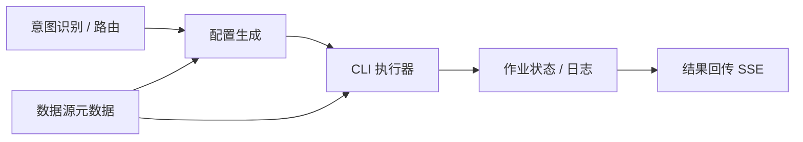

# DataAgent 自定义扩展路线（面向 SeaTunnel 接入）

> 本文档说明：在正式接入 Apache SeaTunnel 之前，可以通过哪些自定义扩展为后期完整接入铺路。

## 总体思路

SeaTunnel 接入需要的能力可以拆成 6 块，项目里大多已有**可复用的模式**：



当前项目**已有** SQL/Python/Report 全链路，**还没有** CLI 执行层和「数据同步」意图分支——这正是扩展的切入点。

---

## 可扩展功能清单（按 SeaTunnel 准备价值排序）

### 第一梯队：必做（SeaTunnel 的地基）

| # | 扩展项 | 练到什么 | 与 SeaTunnel 的关系 |
|---|--------|----------|---------------------|
| **1** | **通用 CLI Executor** | `ProcessBuilder`、超时、stdout/stderr 采集 | SeaTunnel 本质是调 `seatunnel.sh/cmd` |
| **2** | **CLI 配置 Properties** | `spring.ai.alibaba.data-agent.*` 扩展模式 | 可执行路径、超时、工作目录 |
| **3** | **Hello Node 闭环** | 加 Node → 注册图 → Dispatcher → 测试 | 后面所有 SeaTunnel Node 都走这套 |
| **4** | **意图识别扩展** | 新分类 + 新 Dispatcher 分支 | 「同步 A 表到 B 库」不应走完整 NL2SQL 链 |

**参考实现：**

- CLI 执行：参考 `LocalCodePoolExecutorService`（`ProcessBuilder` + `waitFor` + 超时）
- 加 Node：按 `.cursor/rules/backend-workflow-node.mdc` 六步（`Constant` → `DataAgentConfiguration` → Dispatcher → 测试）
- 意图路由：参考 `IntentRecognitionDispatcher` 的二分法，扩展为多分类

**第 1 步最小验证：** 配置里写 `cli-path: echo`（或 Windows 的 `cmd /c echo`），Node 调 CLI，SSE 里看到 stdout——链路即通。

---

### 第二梯队：强烈建议（SeaTunnel 核心逻辑）

| # | 扩展项 | 练到什么 | 与 SeaTunnel 的关系 |
|---|--------|----------|---------------------|
| **5** | **数据源 → 连接配置映射** | 复用 `Datasource` + `DatasourceTypeHandler` | Source/Sink 的 JDBC 参数来自现有数据源表 |
| **6** | **Job 配置生成 Service** | 模板 / LLM 生成结构化配置 | SeaTunnel 需要 HOCON/JSON job 文件 |
| **7** | **临时文件管理** | 写 config → 执行 → 清理 | 与 Python 执行器写 `script.py` 同理 |
| **8** | **SeaTunnelTaskNode（雏形）** | 读 state → 调 Executor → 写 output key | 正式接入时的主 Node |

现有 `Datasource` 已有 host/port/database/username/password，`MysqlDatasourceTypeHandler.toDbConfig()` 可直接复用或扩展为 SeaTunnel JDBC connector 片段。

**第 8 步雏形：** 不跑真 SeaTunnel，先用固定 HOCON 模板 + 你已有的两个 MySQL 数据源，CLI 换成 `cat` 打印配置，验证「解析用户意图 → 选数据源 → 生成 config → 执行」。

---

### 第三梯队：完整体验（「完美接入」所需）

| # | 扩展项 | 说明 |
|---|--------|------|
| **9** | **Plan 集成** | 在 `PlanExecutorNode.SUPPORTED_NODES` 和 `planner.txt` 增加 `SEATUNNEL_TASK_NODE` |
| **10** | **独立图分支（推荐并行）** | 同步类意图直达 SeaTunnel 链，跳过 Schema/Planner（省 token、更快） |
| **11** | **作业状态轮询 Node** | 解析 SeaTunnel 日志 / REST API，更新 state |
| **12** | **MCP Tool** | 参考 `McpServerService.nl2SqlToolCallback`，暴露 `submitSyncTask` |
| **13** | **前端 SSE 展示** | 节点进度、CLI 日志流、成功/失败态 |
| **14** | **Human Feedback 接入** | 同步前让用户确认 source/target/表名（高风险操作） |

`PlanExecutorNode` 目前只认三种工具：

```java
private static final Set<String> SUPPORTED_NODES = Set.of(
    SQL_GENERATE_NODE, PYTHON_GENERATE_NODE, REPORT_GENERATOR_NODE);
```

接 SeaTunnel 时要扩展这里，并同步改 `planner.txt` 的 Available Tools。

---

### 第四梯队：可选增强（接入后 polish）

| 扩展项 | 价值 |
|--------|------|
| 同步任务历史表（job_id、status、config 快照） | 可审计、可重试 |
| 数据质量 / 探查轻量路径 | 「先看看 A 表有多少行再同步」 |
| Connector 类型扩展（PostgreSQL、Kafka 等） | 复用 `DatasourceTypeHandler` 插件模式 |
| 与现有 NL2SQL 组合 Plan | 「先查再同步」类复杂场景 |

---

## 推荐实践路线（约 4 个阶段）

### 阶段 0：定向 Trace（1～2 天，几乎不改代码）

跟通一条 NL2SQL 请求，重点看：

- `GraphServiceImpl` → SSE 怎么推
- `PlanExecutorNode` → 怎么按 `tool_to_use` 调度
- `PythonExecuteNode` → 怎么调外部进程

**产出：** 能画出「加一个新 Node 要动哪些文件」。

---

### 阶段 1：CLI 基础设施（3～5 天）

```
CliExecutorProperties     # spring.ai.alibaba.data-agent.cli-executor.*
CliExecutorService        # 参考 LocalCodePoolExecutorService
CliEchoNode（或 MCP Tool） # 验证调用 + 结果回写
单元测试                   # 超时、非零 exit code
```

**验收：** 前端或 API 触发后，能在 SSE 里看到 CLI 输出。

---

### 阶段 2：意图 + 路由（3～5 天）

```
扩展 intent-recognition.txt   # 增加《数据同步任务》
IntentRecognitionDispatcher   # 新分支 → SeaTunnel 准备链（或临时 Echo Node）
（可选）Feasibility 跳过       # 同步请求不必做 Schema 召回
```

**验收：** 「把 orders 表同步到 B 库」走短链路，不再进 Planner/SQL。

**架构建议：** SeaTunnel 用**独立短链**为主；Plan 集成留给「先分析再同步」等混合场景。

---

### 阶段 3：配置生成 + 数据源桥接（5～7 天）

```
SeatunnelConfigBuilder        # Datasource → source/sink HOCON
SeatunnelConfigGenerateNode   # LLM 或规则：表名、字段、过滤条件
临时目录写 *.conf             # 参考 Python 写 script.py
```

**验收：** 本地 SeaTunnel 已安装时，用两个已有 MySQL 数据源跑通 `mysql → mysql` 单表同步。

---

### 阶段 4：生产化接入（7～10 天）

```
SeaTunnelTaskNode           # 提交作业
SeaTunnelStatusNode         # 轮询 / 解析日志
Human Feedback 确认         # 执行前展示 config
MCP Tool                    # 外部 Agent 可调用
前端进度与日志              # 同步任务 UI
Plan 集成（可选）           # SEATUNNEL_TASK_NODE 进 Planner
```

**验收：** 自然语言 → 确认 → 提交 → 看进度 → 成功/失败反馈，全链路闭环。

---

## 两条接入架构（后期选型）

### 方案 A：独立短链（推荐先做）

```
用户: "把 A 库的 orders 同步到 B 库"
  → Intent《数据同步任务》
  → SyncIntentParseNode（解析表/库）
  → SeatunnelConfigGenerateNode
  → [HumanFeedback 确认]
  → SeaTunnelTaskNode
  → END（或 StatusNode）
```

- **优点：** 不污染 NL2SQL；成本低、可控。

### 方案 B：Plan 内嵌（后期补充）

```
用户: "分析各地区销售，然后把结果表同步到数仓"
  → 完整分析链 + Plan 中含 SEATUNNEL_TASK_NODE
```

- **优点：** 支持组合任务；需改 `PlanExecutorNode` + `planner.txt`。

**建议：** 阶段 1～3 用方案 A；稳定后再做方案 B。

---

## 不建议过早做的扩展

| 扩展 | 原因 |
|------|------|
| 大改 Intent 四阶段全套分类 | 先做「同步 vs 分析」二分即可 |
| 重写 Python Executor 去跑 SeaTunnel | CLI 与 Python 应分离 |
| 一上来做 Kafka/多 Connector | 先用 MySQL→MySQL 打通 |
| 前端大改 | 阶段 1～3 用日志 + API 验证即可 |
| 完整作业调度平台 | 先 CLI 同步执行，再考虑异步队列 |

---

## 和现有模块的对应关系

| 你要扩展的 | 现有参考 |
|-----------|----------|
| 外部进程 | `LocalCodePoolExecutorService` |
| 工作流 Node | `PythonExecuteNode`、`SqlExecuteNode` |
| 路由 | `IntentRecognitionDispatcher`、`PlanExecutorDispatcher` |
| 配置 | `CodeExecutorProperties`、`DataAgentProperties` |
| 数据源 | `Datasource`、`DatasourceTypeHandler` |
| 对外 Tool | `McpServerService` |
| Prompt | `prompts/intent-recognition.txt`、`planner.txt` |
| 测试 | `PlanExecutorNodeTest`、`IntentRecognitionDispatcherTest` |

---

## 一句话总结

**可以扩展，且应该扩展。** 按 **CLI Executor → Hello Node → 意图路由 → 数据源映射 → 配置生成 → SeaTunnelTaskNode** 递进，每一步都可独立验收；全部完成后，就是「完美接入 SeaTunnel」所需的架构，而不是临时补丁。

建议从**阶段 1 的 `CliExecutorService`** 开始——要新建哪些类、改哪些配置、`Constant` 里加什么常量，可按实际环境（Windows/Linux）区分 CLI 路径。
