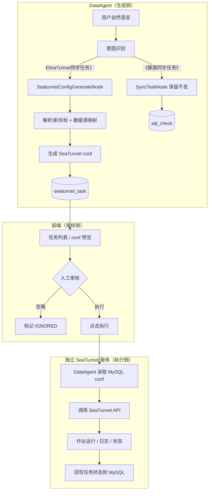
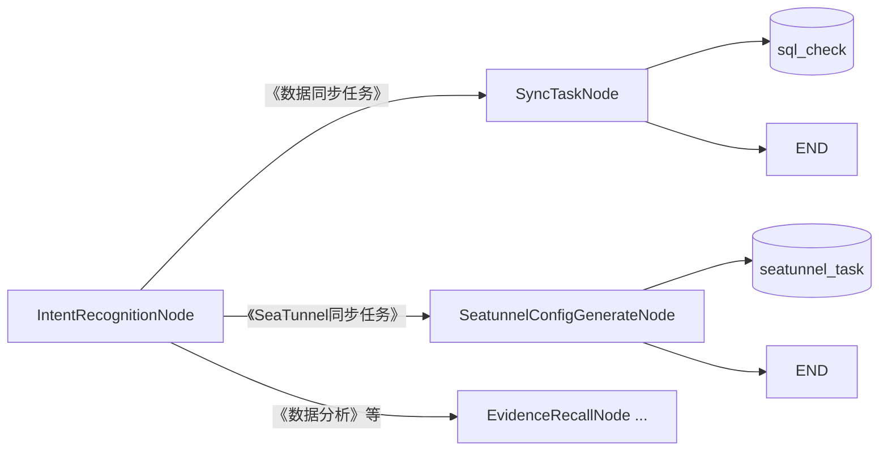

# DataAgent SeaTunnel 扩展路线（任务平台架构）

> 本文档描述 SeaTunnel 接入的**目标架构**：意图识别 → 生成 conf → 落库 → 页面人工审核 → 独立 SeaTunnel 服务执行。
> 与「DataAgent 内嵌 CLI、临时文件、Graph 内 Human Feedback」方案不同，本路线以**任务持久化 + 服务化执行**为核心。

## 核心思路（四步）



| 步骤 | 职责 | 落点 |
|------|------|------|
| **1. 意图识别扩展** | 新增《SeaTunnel同步任务》分类，路由到 conf 生成短链；现有《数据同步任务》仍走 `SyncTaskNode`，**互不影响** | `IntentRecognitionDispatcher` + 新建 `SeatunnelConfigGenerateNode` |
| **2. conf 落 MySQL** | 生成 HOCON/JSON 配置，写入任务表（含源/目标、状态、快照） | 新建 `seatunnel_task` 表 + Service |
| **3. 页面人工审核** | 列表展示 conf，支持预览、忽略、批准执行 | 前端任务中心页 |
| **4. 独立服务执行** | 审核通过后，DataAgent 读库并调用 SeaTunnel 服务 API 提交作业 | 独立部署的 SeaTunnel Gateway |

**设计原则：**

- **生成与执行解耦**：对话流只负责「理解 + 产出 conf」；执行是独立的 REST 动作，可跨会话、可隔天操作。
- **MySQL 为任务真相**：conf 快照、审批状态、外部 job_id、错误信息均持久化，可审计、可重试。
- **SeaTunnel 独立部署**：DataAgent 不安装 `seatunnel.sh`，不持有进程执行权限；通过 HTTP API 委托执行。

---

## 系统边界

```
┌─────────────────────┐     ┌─────────────────────┐     ┌─────────────────────┐
│   data-agent-       │     │       MySQL         │     │  SeaTunnel Gateway  │
│   management        │────▶│  seatunnel_task     │◀────│  (独立服务)          │
│                     │     │  (+ datasource 等)  │     │                     │
│  Graph: 意图→生成    │     └─────────▲───────────┘     │  POST /jobs         │
│  REST: 列表/执行/忽略 │               │                   │  GET  /jobs/{id}    │
└──────────▲──────────┘               │                   └──────────▲──────────┘
           │                           │                              │
┌──────────┴──────────┐               │                   ┌──────────┴──────────┐
│  data-agent-        │───────────────┘                   │  Apache SeaTunnel   │
│  frontend           │  审核页读列表、点执行               │  集群 / 本地安装     │
│  SeaTunnel 任务中心  │──────────────────────────────────▶│  seatunnel.sh       │
└─────────────────────┘  DataAgent 代理调用 Gateway         └─────────────────────┘
```

| 组件 | 负责 | 不负责 |
|------|------|--------|
| **DataAgent Graph** | 意图分流、解析表名、映射数据源、LLM/模板生成 conf、写任务表 | 直接调 `seatunnel.sh`、长期轮询作业 |
| **DataAgent REST** | 任务 CRUD、触发执行（读库 → 调 Gateway）、状态回写 | 渲染复杂审核 UI 以外的业务 |
| **MySQL** | conf 快照、PENDING/APPROVED/RUNNING/SUCCESS/FAILED/IGNORED | — |
| **前端** | 任务列表、conf 语法高亮预览、执行/忽略按钮、状态展示 | 生成 conf |
| **SeaTunnel Gateway** | 接收 conf、写临时 job 文件、调 CLI、返回 job_id、提供状态/日志查询 | 自然语言理解、数据源元数据 |

---

## 意图路由：方案 A（双链路并行，推荐）

**不修改**现有 `SyncTaskNode`，新建独立 Node 与意图分类，两条同步链路长期并存：

| 意图分类 | 路由目标 | 产出 | 审批表 | 执行方式 |
|---------|---------|------|--------|---------|
| `《数据同步任务》`（已有） | `SyncTaskNode` | MySQL 同步 SQL | `sql_check` | `SqlCheckService` 数据源直连执行 |
| `《SeaTunnel同步任务》`（新增） | `SeatunnelConfigGenerateNode` | SeaTunnel HOCON conf | `seatunnel_task` | `SeatunnelTaskService` 调 Gateway API |



**实施要点：**

- `intent-recognition.txt`：增加 `《SeaTunnel同步任务》` 定义与 few-shot，与 `《数据同步任务》` 区分（跨库大批量、需 SeaTunnel 引擎等场景走后者）。
- `Constant.java`：新增 `INTENT_CLASSIFICATION_SEATUNNEL_SYNC_TASK`、`SEATUNNEL_CONFIG_GENERATE_NODE` 等常量。
- `IntentRecognitionDispatcher`：在现有 `SYNC_TASK_NODE` 分支旁**新增** `SEATUNNEL_CONFIG_GENERATE_NODE` 分支；`SyncTaskNode` 相关代码零改动。
- `DataAgentConfiguration`：注册新 Node，`addConditionalEdges` 增加新路由；新 Node 完成后直接 `END`。

---

## 与现有代码的关系

项目里已有一套**高度相似**的 SQL 审批链路，作为 SeaTunnel 任务的**实现模板**（复制模式，不替换原链路）：

| 已有能力（保留不变） | 路径 | SeaTunnel 新建对应 |
|-------------------|------|-------------------|
| 意图 → SQL 同步分支 | `IntentRecognitionDispatcher` → `SyncTaskNode` | **不动**；另增 → `SeatunnelConfigGenerateNode` |
| SQL 审批表 | `sql_check` 表 | 新建 `seatunnel_task` 表 |
| SQL 持久化 + 执行 | `SqlCheckService` | `SeatunnelTaskService` |
| SQL REST API | `SqlCheckController` `/api/sql-check` | `SeatunnelTaskController` `/api/seatunnel-task` |
| SQL 前端审核页 | `SqlApproval.vue` + `sqlCheck.ts` | `SeatunnelTask.vue` + `seatunnelTask.ts` |

`SyncTaskNode` 继续生成 **MySQL 同步 SQL** 并写入 `sql_check`；新建的 `SeatunnelConfigGenerateNode` 负责生成 **SeaTunnel HOCON conf** 并写入 `seatunnel_task`。`SqlCheckService.execute()` 保持数据源直连执行；SeaTunnel 执行走**外部 Gateway API**。

`SeatunnelConfigGenerateNode` 可复用 `TableSyncService` 中「解析源/目标表、校验表是否存在」等逻辑，但**不继承、不修改** `SyncTaskNode` 类本身。

`CliExecutorService` / `CliEchoNode` 可作为**本地开发验证**工具保留，但**不是生产执行路径**。

---

## 可扩展功能清单

### 第一梯队：必做（主链路）

| # | 扩展项 | 说明 |
|---|--------|------|
| **1** | **意图识别扩展（方案 A）** | `intent-recognition.txt` 新增《SeaTunnel同步任务》；`IntentRecognitionDispatcher` 新增分支 → `SeatunnelConfigGenerateNode`；`《数据同步任务》` → `SyncTaskNode` 保持不变 |
| **2** | **独立短链（跳过 NL2SQL）** | 《SeaTunnel同步任务》不进 Schema/Planner/Feasibility，省 token、降延迟 |
| **3** | **数据源 → Connector 映射** | 复用 `Datasource` + `DatasourceTypeHandler`，生成 source/sink JDBC 片段 |
| **4** | **新建 conf 生成 Node** | `SeatunnelSyncComplexityRouter` 分流：简单场景走 `SeatunnelConfigBuilder` 模板，复杂场景走 `SeatunnelConfGenerateService`（LLM + Schema 召回 + 凭证注入）；**不修改** `SyncTaskNode` |
| **5** | **MySQL 任务表** | `seatunnel_task`：conf 全文、源/目标表、数据源 ID、状态、外部 job_id、错误信息 |
| **6** | **任务 Service + REST** | 保存、列表、执行、忽略；执行时读 conf 调 Gateway |
| **7** | **前端审核页** | 列表 + conf 预览 + 执行/忽略（参考 `SqlApproval.vue`） |
| **8** | **SeaTunnel Gateway（独立服务）** | 暴露提交/查询 API；内部写临时 conf 并调 `seatunnel.sh` |

### 第二梯队：生产必备

| # | 扩展项 | 说明 |
|---|--------|------|
| **9** | **执行状态同步** | Gateway 回调或 DataAgent 轮询 `GET /jobs/{id}`，更新 `seatunnel_task.exec_status` |
| **10** | **日志展示** | 前端展示 stdout/stderr 或 Gateway 提供的日志片段 |
| **11** | **配置项** | `spring.ai.alibaba.data-agent.seatunnel-gateway.*`：base-url、超时、鉴权 |
| **12** | **安全** | Gateway API Key；conf 中数据源密码脱敏展示；执行权限校验 |

### 第三梯队：体验增强（后期）

| # | 扩展项 | 说明 |
|---|--------|------|
| **13** | **MCP Tool** | `submitSyncTask` / `listSeatunnelTasks`，供外部 Agent 调用 |
| **14** | **对话内提示** | SSE 流告知「已生成 conf，请到任务中心审核」，不必在 Graph 内阻塞等人 |
| **15** | **Plan 集成（可选）** | 「先分析再同步」场景：`SEATUNNEL_TASK_NODE` 进 `PlanExecutorNode` |
| **16** | **Connector 扩展** | PostgreSQL、Kafka 等，复用 `DatasourceTypeHandler` 插件模式 |
| **17** | **重试 / 历史** | 失败任务一键重提；按 job_id 查历史运行 |

---

## 推荐实践路线（4 个阶段）

### 阶段 0：熟悉现有审批模式（0.5～1 天）

跟通现有 SQL 审批链路（即 SeaTunnel 任务的蓝本）：

- `SyncTaskNode` → `SqlCheckService.save()` → `sql_check` 表
- `SqlCheckController` → `SqlApproval.vue` → 执行/忽略
- `GraphServiceImpl` SSE 与 `IntentRecognitionDispatcher` 路由

**产出：** 明确「在现有 SQL 链路旁**并行新建** SeaTunnel 链路」要新增哪些类；`SyncTaskNode` 不在改动范围内。

---

### 阶段 1：意图识别 + conf 生成 + 落库（5～7 天）

```
扩展 intent-recognition.txt              # 新增《SeaTunnel同步任务》（与《数据同步任务》区分）
Constant.java                            # INTENT_CLASSIFICATION_SEATUNNEL_SYNC_TASK、SEATUNNEL_CONFIG_GENERATE_NODE
IntentRecognitionDispatcher              # 新增分支 → SeatunnelConfigGenerateNode；SyncTaskNode 分支不动
DataAgentConfiguration                   # 注册新 Node + 条件边；新 Node → END
SeatunnelConfigBuilder                   # 简单场景：同库 MySQL 全表 SELECT * 模板
SeatunnelSyncComplexityRouter            # 简单/复杂分流（无关联表 + 目标表存在 + 无过滤语义 → 模板，否则 LLM）
SeatunnelConfGenerateService             # 复杂场景：Schema + LLM 生成 HOCON（占位符）+ PostProcessor 注入凭证
SeatunnelConfigGenerateNode              # 新建 Node（参考 SyncTaskNode 结构，生成 conf 而非 SQL）
seatunnel_task 表 + Entity + Mapper
SeatunnelTaskService.save()              # 参考 SqlCheckService.save()
SeatunnelConfigGenerateNodeTest          # 单元测试
IntentRecognitionDispatcherTest          # 补充《SeaTunnel同步任务》路由用例
```

**建议表结构（`seatunnel_task`）：**

```sql
-- 字段示意，实施时写入 schema.sql
id, agent_id, source_datasource_id, sink_datasource_id,
source_table, target_table, job_config TEXT,          -- SeaTunnel conf 全文
exec_status,           -- PENDING / RUNNING / SUCCESS / FAILED / IGNORED
external_job_id,       -- Gateway 返回的作业 ID
error_msg, create_time, exec_time, update_time
```

**验收：**

- 输入「用 SeaTunnel 把 orders 同步到 orders_backup」→ 走模板路径（`generationMode=TEMPLATE`），conf 含 `SELECT * FROM orders`。
- 输入「将 a 和 c 聚合后同步到 b」或「排除 status=0」→ 走 LLM 路径（`generationMode=LLM`），conf 含自定义 query/transform，凭证由后处理注入。
- 输入「用 SeaTunnel 把 A 库 orders 同步到 B 库」→ 意图识别为《SeaTunnel同步任务》→ 走 `SeatunnelConfigGenerateNode` → `seatunnel_task` 出现一条 `PENDING` 记录。
- 输入同类 SQL 同步诉求 → 仍识别为《数据同步任务》→ `SyncTaskNode` → `sql_check`，行为与改动前一致。

**SIMPLE 判定规则（`SeatunnelSyncComplexityRouter`）：** 无关联表、目标表已存在、用户输入未命中过滤/JOIN/CDC 等复杂语义 → 模板；否则 LLM。

---

### 阶段 2：前端审核页（3～5 天）

```
SeatunnelTaskController    # GET /list, POST /{id}/execute, POST /{id}/ignore
seatunnelTask.ts           # 参考 sqlCheck.ts
SeatunnelTask.vue          # 参考 SqlApproval.vue：conf 语法高亮、状态筛选
路由 /seatunnel-task       # 菜单入口「SeaTunnel 任务」
```

**验收：**

- 页面能列出待审核任务、预览 conf 全文、忽略无效任务。
- 此阶段「执行」可先 Mock（仅改状态），或对接阶段 3 的 Gateway。

---

### 阶段 3：独立 SeaTunnel Gateway + 执行闭环（5～7 天）

**Gateway 服务（新建独立模块或仓库）：**

```
POST /api/jobs          # body: { config: "..." } 或 { taskId, config }
GET  /api/jobs/{jobId}  # 返回 status、exitCode、stdout/stderr 摘要
```

Gateway 内部：写临时 `*.conf` → `ProcessBuilder` 调 `seatunnel.sh -m local -c <file>` → 返回 job_id。

**DataAgent 侧：**

```
SeatunnelGatewayClient           # RestTemplate / WebClient 调 Gateway
SeatunnelTaskService.execute()   # 读 seatunnel_task.job_config → POST Gateway → 更新 RUNNING
SeatunnelTaskStatusPoller        # 定时或手动刷新：GET job 状态 → 回写 SUCCESS/FAILED
spring.ai.alibaba.data-agent.seatunnel-gateway.base-url
```

**验收：**

- 审核页点击「执行」→ Gateway 提交作业 → 任务状态变为 SUCCESS/FAILED，错误信息可查。
- DataAgent 机器上**无需**安装 SeaTunnel（仅 Gateway 机器需要）。

---

### 阶段 4：生产化打磨（5～10 天）

```
鉴权（Gateway API Key、执行人校验）
日志页 / 执行详情抽屉
失败重试、并发控制（同一任务不可重复执行）
MCP Tool（可选）
监控与告警（可选）
```

**验收：** 自然语言 → conf 落库 → 人工审核 → 远程执行 → 状态可追溯，全链路可用于内网试运行。

---

## 主链路时序

```
用户                DataAgent Graph          MySQL           审核页              Gateway
 │                       │                    │                │                    │
 │──"同步 orders 到 B"──▶│                    │                │                    │
 │                       │──意图=SeaTunnel同步─│                │                    │
 │                       │──生成 conf─────────▶│ INSERT PENDING │                    │
 │◀──SSE: 已提交审核─────│                    │                │                    │
 │                       │                    │                │                    │
 │──打开任务中心──────────────────────────────▶│ GET list       │                    │
 │◀──展示 conf────────────────────────────────│                │                    │
 │──点击执行──────────────────────────────────▶│ POST execute   │                    │
 │                       │◀──读 conf──────────│                │                    │
 │                       │──POST /jobs─────────────────────────────────────────────▶│
 │                       │◀──job_id──────────────────────────────────────────────────│
 │                       │──UPDATE RUNNING────▶│                │                    │
 │                       │──轮询状态────────────────────────────────────────────────▶│
 │                       │──UPDATE SUCCESS────▶│                │                    │
 │◀──列表状态已更新────────────────────────────│                │                    │
```

与 Graph 内 `HumanFeedbackNode`（`interruptBefore` + 同 threadId 恢复）不同：本方案**生成即结束 Graph**，审核与执行是**独立的 HTTP 交互**，更适合运维人员异步处理。

---

## SeaTunnel Gateway API 契约（建议）

实施阶段 3 时前后端对齐以下接口：

| 方法 | 路径 | 请求 | 响应 |
|------|------|------|------|
| POST | `/api/jobs` | `{ "config": "<hocon string>" }` | `{ "jobId": "...", "status": "SUBMITTED" }` |
| GET | `/api/jobs/{jobId}` | — | `{ "jobId", "status", "exitCode", "stdout", "stderr", "startTime", "endTime" }` |
| GET | `/api/jobs/{jobId}/logs` | `?tail=200` | `{ "lines": ["..."] }`（可选） |

Gateway 实现可参考 DataAgent 内 `LocalCodePoolExecutorService` / `DefaultCliExecutorService` 的 `ProcessBuilder` 模式，但**部署在独立进程中**。

---

## 配置项（DataAgent）

```yaml
spring:
  ai:
    alibaba:
      data-agent:
        seatunnel-gateway:
          # SeaTunnel Gateway 服务地址
          base-url: http://localhost:8090
          # 提交作业超时（毫秒）
          submit-timeout-ms: 30000
          # 状态轮询间隔（毫秒，0 表示仅手动刷新）
          status-poll-interval-ms: 5000
          # Gateway API Key（可选）
          api-key: ""
```

---

## 不建议过早做的扩展

| 扩展 | 原因 |
|------|------|
| DataAgent 内嵌 `seatunnel.sh` 作为生产执行 | 与独立服务架构冲突；仅适合 Gateway 内部或本地调试 |
| 修改或替换 `SyncTaskNode` | 方案 A 要求 SQL 链路与 SeaTunnel 链路并行；新建 Node 即可 |
| 大改 Intent 全套多分类 | 本阶段仅新增《SeaTunnel同步任务》一个分类，保留现有《数据同步任务》 |
| 一上来 Kafka / 多 Connector | 先用 MySQL→MySQL 打通 conf 生成与审核执行 |
| Graph 内 Human Feedback 阻塞等人 | 本架构用页面审核，Graph 应快速结束 |
| 完整作业调度平台（队列、DAG） | 先单任务同步执行 + 状态回写，再考虑队列 |
| 用 Python Executor 跑 SeaTunnel | CLI 与 Python 职责分离 |

---

## 与现有模块的对应关系

| 你要扩展的 | 现有参考 |
|-----------|----------|
| 意图路由（方案 A） | `IntentRecognitionDispatcher`：新增 SeaTunnel 分支；`SyncTaskDispatcher` 仅服务 SQL 链路 |
| SQL 同步 Node（保留） | `SyncTaskNode` → `sql_check`（不改动） |
| SeaTunnel 同步 Node（新建） | `SeatunnelConfigGenerateNode`（参考 `SyncTaskNode` 结构） |
| SQL 审批表 + 执行 | `sql_check`、`SqlCheckService`、`SqlCheckController`（保留） |
| SeaTunnel 审批表 + 执行 | `seatunnel_task`、`SeatunnelTaskService`、`SeatunnelTaskController`（新建） |
| 前端审核页 | `SqlApproval.vue`、`sqlCheck.ts` |
| 数据源映射 | `Datasource`、`MysqlDatasourceTypeHandler.toDbConfig()` |
| 工作流 Node 规范 | `.cursor/rules/backend-workflow-node.mdc` |
| 外部 HTTP 调用 | 可参考项目中其他 `RestTemplate` / `WebClient` 用法 |
| Prompt | `prompts/intent-recognition.txt` |
| 本地 CLI 验证（非生产） | `CliExecutorService`、`CliEchoNode` |

---

## 后期可选：Plan 组合任务

若需「先 SQL 分析，再把结果表同步到数仓」：

```
用户: "分析各地区销售，然后把结果表同步到数仓"
  → 完整分析链
  → Plan 中含 SEATUNNEL_TASK_NODE
  → 生成 conf 落 seatunnel_task（仍走页面审核 + Gateway 执行）
```

需扩展 `PlanExecutorNode.SUPPORTED_NODES` 与 `planner.txt`。与主链路不冲突：Plan 只影响**如何触发 conf 生成**，执行仍走任务表 + Gateway。

---

## 一句话总结

**按「方案 A：新增《SeaTunnel同步任务》意图 → 新建 `SeatunnelConfigGenerateNode` → conf 落 MySQL → 页面审核 → 独立 SeaTunnel 服务执行」推进。** 现有 `SyncTaskNode` + `sql_check` SQL 审批链路**完整保留**；SeaTunnel 链路**复制其模式**新建，执行走 Gateway API。两条链路通过意图分类分流，互不影响。

**建议起步：** 阶段 1 的 `intent-recognition.txt` 新分类 + `SeatunnelConfigBuilder`（模板）+ `SeatunnelSyncComplexityRouter` / `SeatunnelConfGenerateService`（LLM 分流）+ **新建** `SeatunnelConfigGenerateNode` + `seatunnel_task` 表——先验证《SeaTunnel同步任务》能正确生成 conf 并落库，同时确认《数据同步任务》仍走 `SyncTaskNode` 不受影响。
