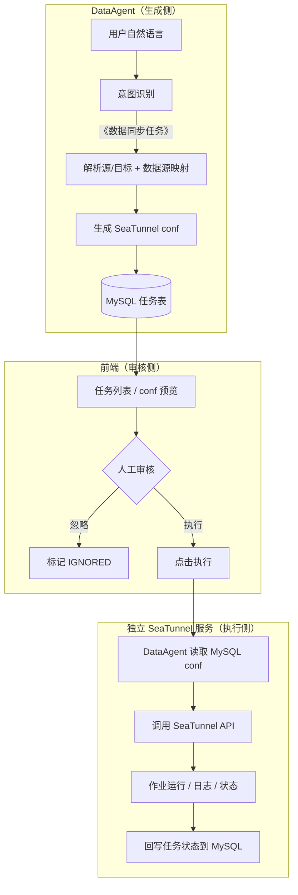

# DataAgent SeaTunnel 扩展路线（任务平台架构）

> 本文档描述 SeaTunnel 接入的**目标架构**：意图识别 → 生成 conf → 落库 → 页面人工审核 → 独立 SeaTunnel 服务执行。
> 与「DataAgent 内嵌 CLI、临时文件、Graph 内 Human Feedback」方案不同，本路线以**任务持久化 + 服务化执行**为核心。

## 核心思路（四步）



| 步骤 | 职责 | 落点 |
|------|------|------|
| **1. 意图识别扩展** | 判断是否为数据同步，路由到 conf 生成链，**不走**完整 NL2SQL/Planner | `IntentRecognitionDispatcher` + 独立短链 |
| **2. conf 落 MySQL** | 生成 HOCON/JSON 配置，写入任务表（含源/目标、状态、快照） | 新建 `seatunnel_task` 表 + Service |
| **3. 页面人工审核** | 列表展示 conf，支持预览、忽略、批准执行 | 前端任务中心页 |
| **4. 独立服务执行** | 审核通过后，DataAgent 读库并调用 SeaTunnel 服务 API 提交作业 | 独立部署的 SeaTunnel Gateway |

**设计原则：**

- **生成与执行解耦**：对话流只负责「理解 + 产出 conf」；执行是独立的 REST 动作，可跨会话、可隔天操作。
- **MySQL 为任务真相**：conf 快照、审批状态、外部 job_id、错误信息均持久化，可审计、可重试。
- **SeaTunnel 独立部署**：DataAgent 不安装 `seatunnel.sh`，不持有进程执行权限；通过 HTTP API 委托执行。

---

## 系统边界

```
┌─────────────────────┐     ┌─────────────────────┐     ┌─────────────────────┐
│   data-agent-       │     │       MySQL         │     │  SeaTunnel Gateway  │
│   management        │────▶│  seatunnel_task     │◀────│  (独立服务)          │
│                     │     │  (+ datasource 等)  │     │                     │
│  Graph: 意图→生成    │     └─────────▲───────────┘     │  POST /jobs         │
│  REST: 列表/执行/忽略 │               │                   │  GET  /jobs/{id}    │
└──────────▲──────────┘               │                   └──────────▲──────────┘
           │                           │                              │
┌──────────┴──────────┐               │                   ┌──────────┴──────────┐
│  data-agent-        │───────────────┘                   │  Apache SeaTunnel   │
│  frontend           │  审核页读列表、点执行               │  集群 / 本地安装     │
│  SeaTunnel 任务中心  │──────────────────────────────────▶│  seatunnel.sh       │
└─────────────────────┘  DataAgent 代理调用 Gateway         └─────────────────────┘
```

| 组件 | 负责 | 不负责 |
|------|------|--------|
| **DataAgent Graph** | 意图分流、解析表名、映射数据源、LLM/模板生成 conf、写任务表 | 直接调 `seatunnel.sh`、长期轮询作业 |
| **DataAgent REST** | 任务 CRUD、触发执行（读库 → 调 Gateway）、状态回写 | 渲染复杂审核 UI 以外的业务 |
| **MySQL** | conf 快照、PENDING/APPROVED/RUNNING/SUCCESS/FAILED/IGNORED | — |
| **前端** | 任务列表、conf 语法高亮预览、执行/忽略按钮、状态展示 | 生成 conf |
| **SeaTunnel Gateway** | 接收 conf、写临时 job 文件、调 CLI、返回 job_id、提供状态/日志查询 | 自然语言理解、数据源元数据 |

---

## 与现有代码的关系

项目里已有一套**高度相似**的 SQL 审批链路，可直接作为 SeaTunnel 任务的模板：

| 已有能力 | 路径 | SeaTunnel 对应 |
|---------|------|----------------|
| 意图 → 同步分支 | `IntentRecognitionDispatcher` → `SyncTaskNode` | 保留路由，节点改为生成 conf |
| 审批表 | `sql_check` 表 | 新建 `seatunnel_task` 表 |
| 持久化 + 执行 | `SqlCheckService` | `SeatunnelTaskService` |
| REST API | `SqlCheckController` `/api/sql-check` | `SeatunnelTaskController` `/api/seatunnel-task` |
| 前端审核页 | `SqlApproval.vue` + `sqlCheck.ts` | `SeatunnelTask.vue` + `seatunnelTask.ts` |

当前 `SyncTaskNode` 生成的是 **MySQL 同步 SQL** 并写入 `sql_check`；目标演进为生成 **SeaTunnel HOCON conf** 并写入 `seatunnel_task`。`SqlCheckService.execute()` 当前在 Agent 数据源上直接跑 SQL；SeaTunnel 版本改为调用**外部 Gateway API**。

`CliExecutorService` / `CliEchoNode` 可作为**本地开发验证**工具保留，但**不是生产执行路径**。

---

## 可扩展功能清单

### 第一梯队：必做（主链路）

| # | 扩展项 | 说明 |
|---|--------|------|
| **1** | **意图识别扩展** | `intent-recognition.txt` 增加《数据同步任务》；`IntentRecognitionDispatcher` 路由到 conf 生成短链 |
| **2** | **独立短链（跳过 NL2SQL）** | 同步意图不进 Schema/Planner/Feasibility，省 token、降延迟 |
| **3** | **数据源 → Connector 映射** | 复用 `Datasource` + `DatasourceTypeHandler`，生成 source/sink JDBC 片段 |
| **4** | **conf 生成 Service** | `SeatunnelConfigBuilder`（模板）+ `SeatunnelConfigGenerateNode`（LLM 补表名、字段、过滤条件） |
| **5** | **MySQL 任务表** | `seatunnel_task`：conf 全文、源/目标表、数据源 ID、状态、外部 job_id、错误信息 |
| **6** | **任务 Service + REST** | 保存、列表、执行、忽略；执行时读 conf 调 Gateway |
| **7** | **前端审核页** | 列表 + conf 预览 + 执行/忽略（参考 `SqlApproval.vue`） |
| **8** | **SeaTunnel Gateway（独立服务）** | 暴露提交/查询 API；内部写临时 conf 并调 `seatunnel.sh` |

### 第二梯队：生产必备

| # | 扩展项 | 说明 |
|---|--------|------|
| **9** | **执行状态同步** | Gateway 回调或 DataAgent 轮询 `GET /jobs/{id}`，更新 `seatunnel_task.exec_status` |
| **10** | **日志展示** | 前端展示 stdout/stderr 或 Gateway 提供的日志片段 |
| **11** | **配置项** | `spring.ai.alibaba.data-agent.seatunnel-gateway.*`：base-url、超时、鉴权 |
| **12** | **安全** | Gateway API Key；conf 中数据源密码脱敏展示；执行权限校验 |

### 第三梯队：体验增强（后期）

| # | 扩展项 | 说明 |
|---|--------|------|
| **13** | **MCP Tool** | `submitSyncTask` / `listSeatunnelTasks`，供外部 Agent 调用 |
| **14** | **对话内提示** | SSE 流告知「已生成 conf，请到任务中心审核」，不必在 Graph 内阻塞等人 |
| **15** | **Plan 集成（可选）** | 「先分析再同步」场景：`SEATUNNEL_TASK_NODE` 进 `PlanExecutorNode` |
| **16** | **Connector 扩展** | PostgreSQL、Kafka 等，复用 `DatasourceTypeHandler` 插件模式 |
| **17** | **重试 / 历史** | 失败任务一键重提；按 job_id 查历史运行 |

---

## 推荐实践路线（4 个阶段）

### 阶段 0：熟悉现有审批模式（0.5～1 天）

跟通现有 SQL 审批链路（即 SeaTunnel 任务的蓝本）：

- `SyncTaskNode` → `SqlCheckService.save()` → `sql_check` 表
- `SqlCheckController` → `SqlApproval.vue` → 执行/忽略
- `GraphServiceImpl` SSE 与 `IntentRecognitionDispatcher` 路由

**产出：** 明确「把 SQL 换成 conf、把 SqlExecutor 换成 Gateway」要改哪些类。

---

### 阶段 1：意图识别 + conf 生成 + 落库（5～7 天）

```
扩展 intent-recognition.txt              # 《数据同步任务》
IntentRecognitionDispatcher              # 已有同步分支，指向新节点
SeatunnelConfigBuilder                   # Datasource → source/sink HOCON 片段
SeatunnelConfigGenerateNode              # 替换/演进 SyncTaskNode：生成 conf 而非 SQL
seatunnel_task 表 + Entity + Mapper
SeatunnelTaskService.save()              # 参考 SqlCheckService.save()
```

**建议表结构（`seatunnel_task`）：**

```sql
-- 字段示意，实施时写入 schema.sql
id, agent_id, source_datasource_id, sink_datasource_id,
source_table, target_table, job_config TEXT,          -- SeaTunnel conf 全文
exec_status,           -- PENDING / RUNNING / SUCCESS / FAILED / IGNORED
external_job_id,       -- Gateway 返回的作业 ID
error_msg, create_time, exec_time, update_time
```

**验收：**

- 输入「把 A 库 orders 同步到 B 库」→ 意图走短链 → MySQL 出现一条 `PENDING` 记录，conf 内容正确（先 MySQL→MySQL 单表）。

---

### 阶段 2：前端审核页（3～5 天）

```
SeatunnelTaskController    # GET /list, POST /{id}/execute, POST /{id}/ignore
seatunnelTask.ts           # 参考 sqlCheck.ts
SeatunnelTask.vue          # 参考 SqlApproval.vue：conf 语法高亮、状态筛选
路由 /seatunnel-task       # 菜单入口「SeaTunnel 任务」
```

**验收：**

- 页面能列出待审核任务、预览 conf 全文、忽略无效任务。
- 此阶段「执行」可先 Mock（仅改状态），或对接阶段 3 的 Gateway。

---

### 阶段 3：独立 SeaTunnel Gateway + 执行闭环（5～7 天）

**Gateway 服务（新建独立模块或仓库）：**

```
POST /api/jobs          # body: { config: "..." } 或 { taskId, config }
GET  /api/jobs/{jobId}  # 返回 status、exitCode、stdout/stderr 摘要
```

Gateway 内部：写临时 `*.conf` → `ProcessBuilder` 调 `seatunnel.sh -m local -c <file>` → 返回 job_id。

**DataAgent 侧：**

```
SeatunnelGatewayClient           # RestTemplate / WebClient 调 Gateway
SeatunnelTaskService.execute()   # 读 seatunnel_task.job_config → POST Gateway → 更新 RUNNING
SeatunnelTaskStatusPoller        # 定时或手动刷新：GET job 状态 → 回写 SUCCESS/FAILED
spring.ai.alibaba.data-agent.seatunnel-gateway.base-url
```

**验收：**

- 审核页点击「执行」→ Gateway 提交作业 → 任务状态变为 SUCCESS/FAILED，错误信息可查。
- DataAgent 机器上**无需**安装 SeaTunnel（仅 Gateway 机器需要）。

---

### 阶段 4：生产化打磨（5～10 天）

```
鉴权（Gateway API Key、执行人校验）
日志页 / 执行详情抽屉
失败重试、并发控制（同一任务不可重复执行）
MCP Tool（可选）
监控与告警（可选）
```

**验收：** 自然语言 → conf 落库 → 人工审核 → 远程执行 → 状态可追溯，全链路可用于内网试运行。

---

## 主链路时序

```
用户                DataAgent Graph          MySQL           审核页              Gateway
 │                       │                    │                │                    │
 │──"同步 orders 到 B"──▶│                    │                │                    │
 │                       │──意图=数据同步──────│                │                    │
 │                       │──生成 conf─────────▶│ INSERT PENDING │                    │
 │◀──SSE: 已提交审核─────│                    │                │                    │
 │                       │                    │                │                    │
 │──打开任务中心──────────────────────────────▶│ GET list       │                    │
 │◀──展示 conf────────────────────────────────│                │                    │
 │──点击执行──────────────────────────────────▶│ POST execute   │                    │
 │                       │◀──读 conf──────────│                │                    │
 │                       │──POST /jobs─────────────────────────────────────────────▶│
 │                       │◀──job_id──────────────────────────────────────────────────│
 │                       │──UPDATE RUNNING────▶│                │                    │
 │                       │──轮询状态────────────────────────────────────────────────▶│
 │                       │──UPDATE SUCCESS────▶│                │                    │
 │◀──列表状态已更新────────────────────────────│                │                    │
```

与 Graph 内 `HumanFeedbackNode`（`interruptBefore` + 同 threadId 恢复）不同：本方案**生成即结束 Graph**，审核与执行是**独立的 HTTP 交互**，更适合运维人员异步处理。

---

## SeaTunnel Gateway API 契约（建议）

实施阶段 3 时前后端对齐以下接口：

| 方法 | 路径 | 请求 | 响应 |
|------|------|------|------|
| POST | `/api/jobs` | `{ "config": "<hocon string>" }` | `{ "jobId": "...", "status": "SUBMITTED" }` |
| GET | `/api/jobs/{jobId}` | — | `{ "jobId", "status", "exitCode", "stdout", "stderr", "startTime", "endTime" }` |
| GET | `/api/jobs/{jobId}/logs` | `?tail=200` | `{ "lines": ["..."] }`（可选） |

Gateway 实现可参考 DataAgent 内 `LocalCodePoolExecutorService` / `DefaultCliExecutorService` 的 `ProcessBuilder` 模式，但**部署在独立进程中**。

---

## 配置项（DataAgent）

```yaml
spring:
  ai:
    alibaba:
      data-agent:
        seatunnel-gateway:
          # SeaTunnel Gateway 服务地址
          base-url: http://localhost:8090
          # 提交作业超时（毫秒）
          submit-timeout-ms: 30000
          # 状态轮询间隔（毫秒，0 表示仅手动刷新）
          status-poll-interval-ms: 5000
          # Gateway API Key（可选）
          api-key: ""
```

---

## 不建议过早做的扩展

| 扩展 | 原因 |
|------|------|
| DataAgent 内嵌 `seatunnel.sh` 作为生产执行 | 与独立服务架构冲突；仅适合 Gateway 内部或本地调试 |
| 大改 Intent 全套多分类 | 先做「同步 vs 分析」二分即可 |
| 一上来 Kafka / 多 Connector | 先用 MySQL→MySQL 打通 conf 生成与审核执行 |
| Graph 内 Human Feedback 阻塞等人 | 本架构用页面审核，Graph 应快速结束 |
| 完整作业调度平台（队列、DAG） | 先单任务同步执行 + 状态回写，再考虑队列 |
| 用 Python Executor 跑 SeaTunnel | CLI 与 Python 职责分离 |

---

## 与现有模块的对应关系

| 你要扩展的 | 现有参考 |
|-----------|----------|
| 意图路由 | `IntentRecognitionDispatcher`、`SyncTaskDispatcher` |
| 同步任务 Node | `SyncTaskNode`（演进为 conf 生成） |
| 审批表 + 执行 | `sql_check`、`SqlCheckService`、`SqlCheckController` |
| 前端审核页 | `SqlApproval.vue`、`sqlCheck.ts` |
| 数据源映射 | `Datasource`、`MysqlDatasourceTypeHandler.toDbConfig()` |
| 工作流 Node 规范 | `.cursor/rules/backend-workflow-node.mdc` |
| 外部 HTTP 调用 | 可参考项目中其他 `RestTemplate` / `WebClient` 用法 |
| Prompt | `prompts/intent-recognition.txt` |
| 本地 CLI 验证（非生产） | `CliExecutorService`、`CliEchoNode` |

---

## 后期可选：Plan 组合任务

若需「先 SQL 分析，再把结果表同步到数仓」：

```
用户: "分析各地区销售，然后把结果表同步到数仓"
  → 完整分析链
  → Plan 中含 SEATUNNEL_TASK_NODE
  → 生成 conf 落 seatunnel_task（仍走页面审核 + Gateway 执行）
```

需扩展 `PlanExecutorNode.SUPPORTED_NODES` 与 `planner.txt`。与主链路不冲突：Plan 只影响**如何触发 conf 生成**，执行仍走任务表 + Gateway。

---

## 一句话总结

**按「意图分流 → 生成 conf 落 MySQL → 页面审核 → 独立 SeaTunnel 服务执行」推进。** 复用现有 `sql_check` 审批模式，把「SQL 快照」换成「conf 快照」，把「数据源直连执行」换成「Gateway API」。生成在 DataAgent Graph 内完成，执行在独立服务中完成，MySQL 贯穿全程作为任务与审计中心。

**建议起步：** 阶段 1 的 `SeatunnelConfigBuilder` + `seatunnel_task` 表 + 演进 `SyncTaskNode`——在现有意图路由已通的前提下，先验证 conf 生成与落库是否正确。
