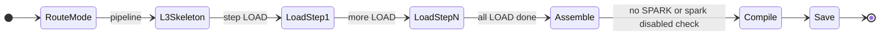
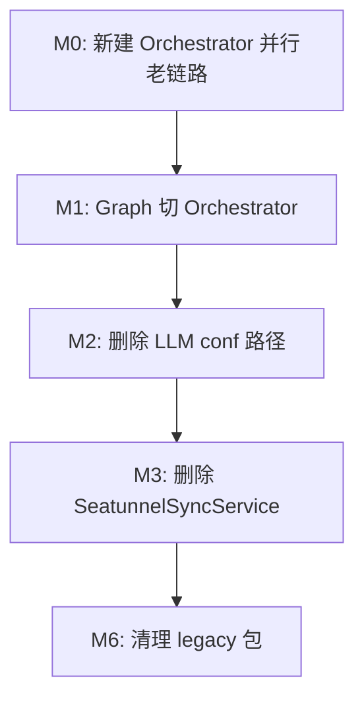
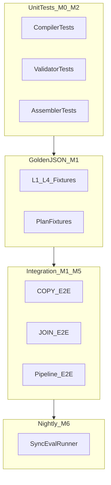
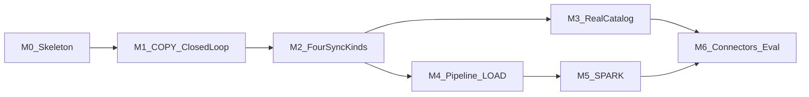

# SeaTunnel 同步扩展 — M0～M6 类文件清单与迁移映射

> **版本**：v1.2（对齐指导书 v1.3）  
> **依据**：[SEATUNNEL_SYNC_EXTENSION_GUIDE.txt](SEATUNNEL_SYNC_EXTENSION_GUIDE.txt) §二十一（M0～M6 + 测试体系）  
> **对照范围**：`data-agent-management` 中 38 个 SeaTunnel 相关类 + 前端审批页  
> **用途**：排期开发、Code Review 对照、迁移验收清单

---

## 目录

1. [目标包结构总览](#1-目标包结构总览)
2. [检索与渐进式解析分工](#2-检索与渐进式解析分工)
3. [现有类处置总表](#3-现有类处置总表reuse--refactor--deprecate)
4. [M0～M6 分里程碑清单](#4-m0m6-分里程碑清单)
5. [横切：Prompt / SQL / 前端 / 废弃时间表](#5-横切prompt--sql--前端--废弃时间表)
6. [测试体系汇总](#6-测试体系汇总)
7. [排期建议与依赖图](#7-排期建议与依赖图)

---

## 1. 目标包结构总览

根包：`com.alibaba.cloud.ai.dataagent`

```
dto/
  syncjob/                          # 新建 — 指导书 §十九
    DataPointer.java
    LlmSystemResolve.java
    LlmObjectResolve.java
    LlmSyncIntent.java
    LlmSyncSql.java
    LlmSyncTask.java
    LlmSyncPipeline.java            # M4
    PipelineStepSpec.java           # M4
    LoadStepSpec.java               # M4
    ResolveTrace.java
    SyncResolveResult.java          # resolve 统一返回（plan / clarify / error）
    SyncClarifyRequest.java         # M1
    SyncResolveState.java           # M1
  seatunnel/                        # 保留 — API 层 DTO
    SeatunnelTaskDTO.java           # 扩展字段
    SeatunnelTaskResult.java        # 扩展或废弃 GenerationMode.LLM
    SeatunnelSchemaRecallResult.java

enums/
  SyncKind.java                     # 新建
  PipelineAction.java               # M4
  WriteMode.java
  ResolvePhase.java
  SyncMode.java                     # single / pipeline
  SeatunnelTaskExecStatus.java      # 保留

service/
  sync/                             # 新建 — 编排核心
    SyncOrchestrator.java           # 接口
    SyncOrchestratorImpl.java
    SyncModeRouter.java             # 单步 vs Pipeline
    SyncResolveStateStore.java      # 多轮状态（内存 → M1 可持久化）
    SyncPlanAssembler.java
    PipelineResolveCoordinator.java # M4
    fastpath/
      FastPathDetector.java         # M1
    resolve/                        # L1～L4 Resolver
      SystemResolveService.java     # M1
      ObjectResolveService.java     # M1
      SyncIntentService.java        # M1
      SyncSqlService.java           # M1
      SparkSqlResolveService.java   # M5
    validator/
      SystemResolveValidator.java
      ObjectResolveValidator.java   # M1
      SyncIntentValidator.java      # M2
      SyncSqlValidator.java         # M2
      SyncPlanConsistencyValidator.java
      SqlSafetyValidator.java       # M2
    catalog/                        # Catalog + 对象索引
      SyncCatalogService.java       # 接口
      MockSyncCatalogService.java   # M0
      AgentSyncCatalogService.java  # M3
      SyncObjectIndexService.java   # M3
      DatasourceRefResolver.java    # M3
      SyncCatalogEntry.java         # ref 摘要 BO
      SyncObjectEntry.java          # 表/文件摘要 BO（M3）
      SyncObjectCandidate.java      # L2 Prompt 候选 BO（M3）
      SyncObjectCandidateFormatter.java  # 候选 → Prompt 文本/JSON（M3）
    compiler/                       # conf 编译
      SingleStepCompiler.java
      SingleStepCompilerRegistry.java
      TableCopyCompiler.java
      ColumnMapCompiler.java        # M2
      TableJoinCompiler.java        # M2
      TableUnionCompiler.java       # M2
      PipelineStepCompiler.java     # M4 接口
      LoadStepCompiler.java         # M4
      SparkStepCompiler.java        # M5
      PipelineStepCompilerRegistry.java  # M4
      CredentialInjector.java       # 演进 SeatunnelConfPostProcessor
      CompiledJobConfig.java        # 单 conf 或 steps 数组
      connector/                    # M6
        JdbcConnectorTemplate.java
        IcebergConnectorTemplate.java
        S3ConnectorTemplate.java
    executor/                       # M4/M5 执行
      PipelineExecutionService.java
      SparkJobExecutor.java         # M5
    eval/                           # M6
      SyncEvalRunner.java
  seatunnel/                        # 保留 — 薄层 + Gateway
    SeatunnelTaskService.java       # 改造
    SeatunnelTaskRecompileService.java  # M2
    SeatunnelSchemaRecallService.java
    SeatunnelRelatedTableExpander.java
    SeatunnelConfPostProcessor.java # REUSE，CredentialInjector 内部调用
    gateway/
      SeatunnelGatewayClient.java
      DefaultSeatunnelGatewayClient.java
    legacy/                         # M2 后标记 @Deprecated，M6 删除
      SeatunnelSyncService.java
      SeatunnelConfGenerateService.java
      SeatunnelSyncComplexityRouter.java
      SeatunnelConfigBuilder.java
      SeatunnelTableResolveService.java
      SeatunnelConfValidator.java

workflow/node/
  SeatunnelConfigGenerateNode.java  # 改造 → 调 SyncOrchestrator

workflow/dispatcher/
  IntentRecognitionDispatcher.java  # REUSE
  QueryEnhanceDispatcher.java       # REUSE

controller/
  SeatunnelTaskController.java      # 扩展 detail / recompile

entity/
  SeatunnelTask.java                # 改造
  SeatunnelTaskStep.java            # M4 可选

mapper/
  SeatunnelTaskMapper.java          # 改造

properties/
  SeatunnelProperties.java          # 改造
  SeatunnelGatewayProperties.java   # REUSE

prompt/
  PromptHelper.java                 # 扩展 sync L1～L4 方法
  PromptConstant.java               # 扩展 sync 模板加载
```

### Prompt 资源（新建目录）

```
data-agent-management/src/main/resources/prompts/sync/
  L1-catalog.txt                    # M1
  L2-object.txt                     # M1
  L3-intent.txt                     # M1
  L4-sql-mysql.txt                  # M1
  L3-pipeline-skeleton.txt          # M4
  L4-sql-spark.txt                  # M5
```

### 测试资源（新建目录）

```
data-agent-management/src/test/resources/sync/golden/
  l1-system.json
  l2-object.json
  l3-intent.json
  l4-sql.json
  plan-table-copy.json
  plan-join.json
  plan-pipeline-3step.json

data-agent-management/src/test/resources/eval/sync/
  cases.json                        # M6 nightly 语料
  README.md
```

---

## 2. 检索与渐进式解析分工

> 详述见指导书 [SEATUNNEL_SYNC_EXTENSION_GUIDE.txt §八](SEATUNNEL_SYNC_EXTENSION_GUIDE.txt)（向量/混合检索）  
> 存储分层见 [§十一](SEATUNNEL_SYNC_EXTENSION_GUIDE.txt)（(A) 外部业务数据 / (B) 关系库 / (C) 向量库）

**架构定调：向量检索与 L1～L4 叠加，不是二选一。**

| 机制 | 职责 | 里程碑 | 现有代码复用 |
|------|------|--------|--------------|
| **Catalog（L1）** | ref 清单；真相在关系库 `datasource` + `agent_datasource` | M0 `MockSyncCatalogService` | M3 可选向量 `catalog` TopK |
| **向量 + ES 混合检索（L1/L2）** | ref / object **候选召回**；向量路语义 + ES 关键词路 Fusion，补纯 RAG 对表名/缩写不准 | M3 `SyncObjectIndexService` 调 `AgentVectorStoreService.search` | `ElasticsearchHybridRetrievalStrategy`、`DynamicFilterService`、`SeatunnelSchemaRecallService` |
| **Schema 按需拉列（L3/L4）** | `column` / `file_column` 精确 metadata 过滤或 JDBC/S3 实时；**不对用户话做全库 RAG** | M3 写入索引；M0 仅 JDBC 分析轨已有 | `SchemaService`（JDBC）；M3 扩展 file |
| **渐进式 L1～L4** | **结构化决策**、层间 Validator、Pipeline 状态机、汇总 `LlmSyncTask` | M1 真 Resolver；M0 仅 Mock 骨架 | `SystemResolveValidator`、`SyncPlanAssembler`、`SyncOrchestratorImpl` |
| **Fast Path** | 检索 Top1 置信度高 / TABLE_COPY 明确时 **少调 LLM** | M1 `FastPathDetector` | 配置 `resolve.fast-path-enabled`（§十） |
| **Java Compiler** | 按 syncKind 拼 conf，填凭证 | M0 `TableCopyCompiler` | `CredentialInjector`、`SingleStepCompilerRegistry` |

**纯向量 RAG 的短板**（指导书 §八）：准表名不一定排第一、缩写/口语易偏、相似表名易混 → 生产建议 `vectorstore.type=elasticsearch` + `enable-hybrid-search=true`。

**禁止回退**：「一次 RAG 全召回 Schema → LLM 直接吐 conf」（老 `SeatunnelConfGenerateService` 路子）。

推荐链路（M3+）：

```
用户输入 → [混合检索] Catalog TopK ref → L1 → [混合检索] ObjectIndex TopK（table/file）→ L2
         → [精确拉列] JDBC column / file_column → L3 → L4（sql 或 LoadStepSpec）
         → Validator → Compiler → 落库
```

**L1～L4 与各存储层对照**见指导书 **§11.1**；JDBC/S3 细节见 **§11.2 / §11.3**；对照表 **§11.4**。

**L1/L2 混合检索配置**（指导书 §十七，与 seatunnel 配置并列）：

```yaml
spring.ai.vectorstore.type: elasticsearch
spring.ai.alibaba.data-agent.vector-store.enable-hybrid-search: true
spring.ai.alibaba.data-agent.vector-store.elasticsearch-min-score: 0.5
spring.ai.alibaba.data-agent.seatunnel.resolve.catalog-topk: 10
spring.ai.alibaba.data-agent.seatunnel.resolve.object-index-topk: 8
```

未开混合或未接 ES 时退化为纯向量 RAG，功能可用，L1/L2 召回质量可能差一截。

---

## 3. 现有类处置总表（REUSE / REFACTOR / DEPRECATE）

| 现有类 | 路径 | 处置 | 目标 |
|--------|------|------|------|
| `SeatunnelConfGenerateService` | `service/seatunnel/` | **DEPRECATE** | 删除；conf 改由 Compiler |
| `SeatunnelConfGenerationDTO` | `dto/prompt/` | **DEPRECATE** | 删除 |
| `seatunnel-conf-generate.txt` | `prompts/` | **DEPRECATE** | 删除 |
| `SeatunnelTableResolveDTO` | `dto/prompt/` | **DEPRECATE** | → `LlmObjectResolve` |
| `SeatunnelSyncMode.LLM` | `service/seatunnel/` | **DEPRECATE** | → `SyncKind` |
| `SeatunnelSyncService` | `service/seatunnel/` | **REFACTOR→废弃** | M0 薄包装；M2 移入 `legacy/` |
| `SeatunnelSyncComplexityRouter` | `service/seatunnel/` | **REFACTOR→废弃** | → `FastPathDetector` + `SyncModeRouter` |
| `SeatunnelConfigBuilder` | `service/seatunnel/` | **REFACTOR** | → `TableCopyCompiler` |
| `SeatunnelTableResolveService` | `service/seatunnel/` | **REFACTOR** | → `ObjectResolveService` |
| `SeatunnelConfValidator` | `service/seatunnel/` | **REFACTOR** | 逻辑拆入 layer validators + compile 后校验 |
| `SeatunnelConfPostProcessor` | `service/seatunnel/` | **REUSE** | → `CredentialInjector` 内部复用 |
| `SeatunnelSchemaRecallService` | `service/seatunnel/` | **REUSE** | L2 对象**候选召回**（非最终决策）；M3 并入 `SyncObjectIndexService`，见 §2 |
| `AgentVectorStoreService` | `service/vectorstore/` | **REUSE** | L1/L2 检索入口；`enable-hybrid-search` 时走 `HybridRetrievalStrategy` |
| `ElasticsearchHybridRetrievalStrategy` | `service/hybrid/retrieval/` | **REUSE** | 向量 + ES 关键词 Fusion；M3 同步轨 L1/L2 TopK |
| `DynamicFilterService` | `service/vectorstore/` | **REUSE** | metadata 过滤（agentId、vectorType、ref） |
| `SeatunnelRelatedTableExpander` | `service/seatunnel/` | **REUSE** | L2/L3 关联表扩展 |
| `SeatunnelTaskService` | `service/seatunnel/` | **REFACTOR** | 存 plan/trace；M4 多步执行 |
| `SeatunnelGatewayClient` | `gateway/` | **REUSE** | M4/M5 按步 submit |
| `SeatunnelConfigGenerateNode` | `workflow/node/` | **REFACTOR** | 调 `SyncOrchestrator` |
| `SeatunnelTask` / `Mapper` / `DTO` | entity/mapper/dto | **REFACTOR** | 新增 JSON 字段 |
| `SeatunnelProperties` | `properties/` | **REFACTOR** | 扩展 resolve/spark 配置 |
| `IntentRecognitionDispatcher` | `dispatcher/` | **REUSE** | 保持意图入口 |
| `QueryEnhanceDispatcher` | `dispatcher/` | **REUSE** | 路由不变，节点内部改 |
| `TableSyncService` / `SYNC_TASK_NODE` | `service/sync/` | **隔离** | 不纳入本链路 |

### 现有测试类处置

| 测试类 | 处置 | 目标 |
|--------|------|------|
| `SeatunnelConfGenerateServiceTest` | **DEPRECATE** | M2 删除 |
| `SeatunnelConfigBuilderTest` | **REFACTOR** | → `TableCopyCompilerTest` |
| `SeatunnelConfPostProcessorTest` | **REFACTOR** | → `CredentialInjectorTest` |
| `SeatunnelConfValidatorTest` | **REFACTOR** | → `SqlSafetyValidatorTest` 等 |
| `SeatunnelTableResolveServiceTest` | **REFACTOR** | → `ObjectResolveServiceTest` |
| `SeatunnelSyncServiceTest` | **REFACTOR→废弃** | → `SyncOrchestratorImplTest` |
| `SeatunnelSyncComplexityRouterTest` | **REFACTOR** | → `FastPathDetectorTest` |
| `SeatunnelSchemaRecallServiceTest` | **REUSE** | M3 扩展为 `SyncObjectIndexServiceTest` |
| `ElasticsearchHybridRetrievalStrategyTest` | **REUSE** | M3 同步 L1/L2 混合检索回归（可选） |
| `SeatunnelRelatedTableExpanderTest` | **REUSE** | 保留 |
| `SeatunnelTaskServiceTest` | **REFACTOR** | 扩展 trace/recompile 用例 |
| `SeatunnelConfigGenerateNodeTest` | **REFACTOR** | 断言调 Orchestrator |
| `PromptConstantTest` | **REFACTOR** | 新增 sync L1～L4 模板断言 |

---

## 4. M0～M6 分里程碑清单

> 每节统一模板：**验收标准 → 新建类（含职责）→ 改造类 → 迁移映射 → 测试 → 配置/SQL/前端**

---

### M0 — SyncOrchestrator + Catalog Mock + TableCopyCompiler

#### 验收标准

Mock Catalog 下完成 `resolve → compile → save`，产出合法 MySQL BATCH conf；Graph 节点可调用新 Orchestrator 并落库。

#### 新建类（22 个）— 逐类职责

| 类 | 包 | 职责 |
|----|-----|------|
| `DataPointer` | `dto/syncjob` | ref + object 成对结构；L1 结束后 object 可为空 |
| `LlmSystemResolve` | `dto/syncjob` | L1 输出：sourceRef、targetRef、needClarify |
| `LlmObjectResolve` | `dto/syncjob` | L2 输出：source/sink/others（DataPointer） |
| `LlmSyncIntent` | `dto/syncjob` | L3 输出：syncKind 或 Pipeline 骨架（无 sql） |
| `LlmSyncSql` | `dto/syncjob` | L4 输出：sql 文本或 LoadStepSpec |
| `LlmSyncTask` | `dto/syncjob` | 单步最终计划，含 schemaVersion、syncKind、sql |
| `ResolveTrace` | `dto/syncjob` | 各层 LLM 快照，供审批与按层重试 |
| `SyncResolveResult` | `dto/syncjob` | 统一返回：SUCCESS(plan+conf+trace) / CLARIFY / ERROR |
| `SyncKind` | `enums` | TABLE_COPY / COLUMN_MAP / TABLE_JOIN / TABLE_UNION |
| `ResolvePhase` | `enums` | SYSTEM / OBJECT / INTENT / SQL |
| `SyncMode` | `enums` | SINGLE / PIPELINE |
| `WriteMode` | `enums` | APPEND / OVERWRITE |
| `SyncOrchestrator` | `service/sync` | 接口：`resolve()`、`resume()` |
| `SyncOrchestratorImpl` | `service/sync` | M0：Mock L1～L4，固定 TABLE_COPY 路径 |
| `SyncModeRouter` | `service/sync` | M0：固定返回 SINGLE |
| `SyncPlanAssembler` | `service/sync` | 校验通过后合并 LlmSyncTask + ResolveTrace |
| `SyncCatalogService` | `service/sync/catalog` | 接口：listRefs、getEntry、existsRef |
| `MockSyncCatalogService` | `service/sync/catalog` | 硬编码 1～2 ref + 表名，供 M0～M2 开发 |
| `SyncCatalogEntry` | `service/sync/catalog` | ref + type + 一句话描述 |
| `SingleStepCompiler` | `service/sync/compiler` | 接口：`compile(LlmSyncTask) → CompiledJobConfig` |
| `SingleStepCompilerRegistry` | `service/sync/compiler` | 按 SyncKind 注册 Compiler |
| `TableCopyCompiler` | `service/sync/compiler` | 从 LlmSyncTask 拼 HOCON；sql 空则 SELECT * |
| `CredentialInjector` | `service/sync/compiler` | 按 ref 查凭证注入 conf；内部复用 PostProcessor |
| `CompiledJobConfig` | `service/sync/compiler` | 封装最终 conf 字符串 + 元数据 |
| `SystemResolveValidator` | `service/sync/validator` | ref 必须在 Catalog 中 |
| `SyncPlanConsistencyValidator` | `service/sync/validator` | DataPointer 非空、syncKind 与 others 数量一致 |

#### 改造类（8 个）

| 类 | 改造内容 |
|----|----------|
| `SeatunnelConfigGenerateNode` | 注入 `SyncOrchestrator`；success 时调 `SeatunnelTaskService.save(SyncResolveResult)` |
| `SeatunnelTaskService` | 新增 `save(SyncResolveResult)`；保留旧 `save(SeatunnelTaskResult)` 兼容过渡期 |
| `SeatunnelTask` | 加 `resolveTrace`、`syncPlan`、`syncMode` 字段 |
| `SeatunnelTaskMapper` + `schema.sql` / `schema-h2.sql` | DDL 三列 TEXT |
| `SeatunnelProperties` | 加 `ResolveProperties`（catalog-topk、fast-path-enabled 等） |
| `SeatunnelTaskDTO` | 可选暴露 syncPlan |
| `DataAgentConfiguration` | 注册新 Spring Bean |
| `Constant` | 同步相关 state key（可选） |

#### 迁移映射

| 旧 | 新 | 动作 |
|----|-----|------|
| `SeatunnelConfigBuilder.build()` | `TableCopyCompiler.compile()` | 代码迁移 + 异库双 JDBC 骨架 |
| `SeatunnelConfPostProcessor.injectCredentials()` | `CredentialInjector.inject(ref, conf)` | 包装复用；单 ref 先够用 |
| `SeatunnelSyncService.generateConf()` | `SyncOrchestratorImpl.resolve()` | M0：Orchestrator 内部 Mock L1～L4 |
| `SeatunnelTaskResult.ok(jobConfig,...)` | `SyncResolveResult.success(plan, conf, trace)` | 新返回模型 |
| — | `MockSyncCatalogService` | 硬编码 ref + 表 |

#### 测试清单

| 测试类 / 资源 | 来源 | 说明 |
|---------------|------|------|
| `TableCopyCompilerTest` | 迁移自 `SeatunnelConfigBuilderTest` | conf 快照断言 |
| `CredentialInjectorTest` | 迁移自 `SeatunnelConfPostProcessorTest` | 凭证注入 |
| `SyncPlanAssemblerTest` | 新建 | Mock 四层 JSON → LlmSyncTask |
| `SyncOrchestratorImplTest` | 新建 | Mock Catalog + 固定 L1～L4 |
| `SeatunnelConfigGenerateNodeTest` | 改造 | 断言调 Orchestrator |
| `sync/golden/plan-table-copy.json` | 新建 | golden fixture |

#### 配置 / SQL

```yaml
# application.yml — M0 新增
spring.ai.alibaba.data-agent.seatunnel:
  default-job-mode: BATCH
  default-parallelism: 1
  resolve:
    catalog-topk: 10
    object-index-topk: 8
    fast-path-enabled: true
  enabled-sync-kinds: TABLE_COPY
```

```sql
-- M0 DDL
ALTER TABLE seatunnel_task
  ADD COLUMN resolve_trace TEXT COMMENT 'L1～L4 解析快照 JSON',
  ADD COLUMN sync_plan TEXT COMMENT '最终计划 JSON',
  ADD COLUMN sync_mode VARCHAR(16) DEFAULT 'SINGLE' COMMENT 'SINGLE/PIPELINE';
```

---

### M1 — 单步 TABLE_COPY 闭环 + Fast Path

#### 验收标准

自然语言全表拷贝 → plan → conf → 审批落库；Fast Path 跳过 L3/L4；needClarify 时返回追问且不编译 conf。

#### 新建类（12 个）— 逐类职责

| 类 | 包 | 职责 |
|----|-----|------|
| `SystemResolveService` | `service/sync/resolve` | L1：构建 Catalog 摘要 Prompt，调 LLM 得 LlmSystemResolve |
| `ObjectResolveService` | `service/sync/resolve` | L2：TopK 表候选 + LLM 得 LlmObjectResolve（DataPointer） |
| `SyncIntentService` | `service/sync/resolve` | L3：列级 Schema → syncKind（M1 仅 TABLE_COPY） |
| `SyncSqlService` | `service/sync/resolve` | L4：完整 Schema → SQL（TABLE_COPY 可跳过） |
| `FastPathDetector` | `service/sync/fastpath` | 明显全表拷贝 + 表名清晰 → 跳过 L3/L4 |
| `ObjectResolveValidator` | `service/sync/validator` | object 必须在对象索引中 |
| `SyncResolveState` | `dto/syncjob` | 多轮状态：当前 phase、各层快照、threadId |
| `SyncResolveStateStore` | `service/sync` | 内存存储；用户补信息后从出错层续跑 |
| `SyncClarifyRequest` | `dto/syncjob` | 澄清问题列表 + 缺失 phase |
| `PromptHelper.buildSyncL1Prompt` 等 | `prompt/` | 渲染 L1～L4 Prompt |
| `L1-catalog.txt` | `prompts/sync/` | ref 摘要清单，不给表/列 |
| `L2-object.txt` | `prompts/sync/` | TopK 表名+注释 → DataPointer JSON |
| `L3-intent.txt` | `prompts/sync/` | 列级 Schema → syncKind |
| `L4-sql-mysql.txt` | `prompts/sync/` | MySQL SELECT（M1 仅 COPY 时可不走） |

#### 改造类（4 个）

| 类 | 改造内容 |
|----|----------|
| `SyncOrchestratorImpl` | 接入 L1→L2→L3→L4 状态机；TABLE_COPY 跳过 L4 |
| `SeatunnelSyncService` | 标记 `@Deprecated`；Graph 不再直接调用 |
| `SeatunnelTableResolveService` | 参考实现迁入 `ObjectResolveService`；旧类暂留 |
| `PromptConstant` | 新增 sync L1～L4 模板加载 |

#### 迁移映射

| 旧 | 新 | 动作 |
|----|-----|------|
| `SeatunnelTableResolveService.resolve()` | `ObjectResolveService.resolve()` | Prompt：`seatunnel-table-resolve.txt` → `L2-object.txt` |
| `SeatunnelSyncComplexityRouter`（TEMPLATE 分支） | `FastPathDetector` | 仅保留「全表拷贝 + 表名清晰」 |
| `SeatunnelSchemaRecallService.recall()` | L2 候选输入 | Orchestrator 在 L2 前调 recall |
| `seatunnel-table-resolve.txt` | `L2-object.txt` | 输出改为 DataPointer |

#### 测试清单

| 测试类 / 资源 | 说明 |
|---------------|------|
| `sync/golden/l1-system.json` 等 | 四层 golden fixtures |
| `FastPathDetectorTest` | 跳过 L3/L4 断言 |
| `ObjectResolveServiceTest` | 参考 `SeatunnelTableResolveServiceTest` |
| `SyncOrchestratorIntegrationTest` | TABLE_COPY E2E，Mock LLM |
| `SystemResolveValidatorTest` / `ObjectResolveValidatorTest` | Catalog/索引校验 |

#### 配置

```yaml
spring.ai.alibaba.data-agent.seatunnel:
  enabled-sync-kinds: TABLE_COPY
  resolve:
    fast-path-enabled: true
```

---

### M2 — COLUMN_MAP / JOIN / UNION + ResolveTrace + 审批页 SQL

#### 验收标准

四种 SyncKind 均可 plan→compile；审批页展示 trace + SQL；用户改 SQL 后只重 compile，不重跑 L1～L3。

#### 新建类（8 个）— 逐类职责

| 类 | 包 | 职责 |
|----|-----|------|
| `ColumnMapCompiler` | `service/sync/compiler` | query 来自 L4 SQL 的字段映射同步 |
| `TableJoinCompiler` | `service/sync/compiler` | source + others + JOIN SQL |
| `TableUnionCompiler` | `service/sync/compiler` | source + others + UNION SQL |
| `SyncIntentValidator` | `service/sync/validator` | syncKind 与 others 数量匹配；禁止从 SQL 反推 |
| `SyncSqlValidator` | `service/sync/validator` | SQL 与 syncKind 语义一致 |
| `SqlSafetyValidator` | `service/sync/validator` | 禁 DROP/TRUNCATE/DDL；可选 EXPLAIN |
| `SeatunnelTaskRecompileService` | `service/seatunnel` | 更新 L4 / sync_plan.sql → 重 compile |
| `SeatunnelTaskController.getDetail()` / `recompileSql()` | `controller` | 审批详情 + 改 SQL API |

#### 改造类（6 个）

| 类 | 改造内容 |
|----|----------|
| `SingleStepCompilerRegistry` | 注册 4 种 Compiler |
| `SyncPlanAssembler` | 写完整 ResolveTrace（system/object/intent/sqls） |
| `SeatunnelTaskService` | 存 trace；`recompile(id, newSql)` |
| `SeatunnelTask.vue` | 解析轨迹 + SQL 面板；conf 默认折叠 |
| `seatunnelTask.ts` | DTO 加 syncPlan、resolveTrace、syncKind |
| 移入 `legacy/` | `SeatunnelConfGenerateService`、`SeatunnelSyncService` LLM 分支 |

#### 迁移映射

| 旧 | 新 | 动作 |
|----|-----|------|
| `SeatunnelConfGenerateService.generate()` | `ColumnMapCompiler` 等 | **删除** LLM conf 路径 |
| `SeatunnelSyncComplexityRouter`（LLM 分支） | `SyncIntentService` + Compiler 注册表 | **删除** LLM 分支 |
| `SeatunnelConfValidator` | `SqlSafetyValidator` + compile 后结构校验 | 拆分迁移 |
| `SeatunnelConfGenerationDTO` | — | **删除** |
| `GenerationMode.LLM` | — | **删除** enum 值 |

#### 测试清单

| 测试类 / 资源 | 说明 |
|---------------|------|
| `ColumnMapCompilerTest` / `TableJoinCompilerTest` / `TableUnionCompilerTest` | 各 syncKind conf 快照 |
| `SqlSafetyValidatorTest` | 参考 `SeatunnelConfValidatorTest` DDL 部分 |
| `SyncPlanAssemblerTest` | 四种 syncKind |
| `sync/golden/plan-join.json` | JOIN 计划 golden |
| `SeatunnelTaskServiceTest` | trace 落库 + recompile |
| 删除 `SeatunnelConfGenerateServiceTest` | — |

#### 配置 / 前端

```yaml
spring.ai.alibaba.data-agent.seatunnel:
  enabled-sync-kinds: TABLE_COPY, COLUMN_MAP, TABLE_JOIN, TABLE_UNION
```

| 前端文件 | 变更 |
|----------|------|
| `SeatunnelTask.vue` | 解析轨迹面板（L1→L4）；SQL 高亮；conf 折叠 |
| `seatunnelTask.ts` | 扩展 DTO；`getDetail()`、`recompileSql()` API |
| `SyncPlanPreview.vue`（可选） | 计划 JSON 可视化组件 |

---

### M3 — 真 Catalog + 对象索引（JDBC 表 + S3 文件）+ L1/L2 校验

#### 验收标准

ref/object 必须来自 Agent 授权 Catalog 与对象索引；生产环境不用 Mock。
JDBC 表与 S3 逻辑文件的 Schema 可注册、可刷新；结构变更后刷新索引，L2/L4 能拉到最新列信息。
**L2 候选清单**同时支持 **TABLE（JDBC 表）与 FILE（S3 逻辑文件）**；废除 `ObjectResolveService` 内字符串拼接，改由 `SyncObjectCandidateFormatter` 统一输出（见下文「L2 候选对象格式化」）。
**向量 + ES 混合检索仅作 L1/L2 候选召回**（指导书 §八），不替代 L1～L4 分层与 Validator；L3/L4 仍按 ref+object 精确拉列。

#### 三层存储（与指导书 §十一对齐）

| 层 | 存什么 | 同步轨相关表/索引 |
|----|--------|-------------------|
| **(A) 外部系统** | 业务行、CSV 文件字节 | SeaTunnel 执行期读写 |
| **(B) 关系库** | 连接、授权、Catalog、plan/conf | `datasource`、`agent_datasource`、`agent_datasource_tables`、`seatunnel_task` |
| **(C) 向量库** | Schema 元数据（table/column/file/file_column）；后端可 ES/pgvector/内存 | L1/L2 混合检索；L3/L4 精确拉列 |

#### Schema 明细（§11.2 / §11.3）

| 类型 | 存哪儿 | 何时写入 | M3 负责 |
|------|--------|----------|---------|
| JDBC 连接 | `datasource` | 创建数据源 | 已有 |
| S3 连接/path | `datasource.extra_config` JSON | 创建 S3 数据源 | **新增 DDL** |
| ref L1 摘要（可选） | 向量库 `vectorType=catalog` | 绑 Agent / 改数据源 | M3 可选 |
| 表/文件 L2 摘要 | 向量库 `vectorType=table\|file` | 初始化 Schema / 刷新对象索引 | 扩展 |
| 列 L3/L4 | 向量库 `vectorType=column\|file_column` | 同上；文件可读 CSV header | 扩展 |
| 任务列映射 | `seatunnel_task.sync_plan` LoadStepSpec | 解析落库 | M4 |

#### 新建类（6 个）— 逐类职责

| 类 | 包 | 职责 |
|----|-----|------|
| `AgentSyncCatalogService` | `service/sync/catalog` | 从 AgentDatasource 列出授权 ref 及摘要 |
| `SyncObjectIndexService` | `service/sync/catalog` | 统一对象索引：`search(ref,query)` 经 `AgentVectorStoreService.search`（混合检索 TopK）；`exists(ref,object)` 校验；`refreshJdbcTables` / `refreshFileObject` 写 Document；`getTableSchema` / `getFileSchema` L3/L4 精确拉列 |
| `SyncObjectEntry` | `service/sync/catalog` | 单表或单文件逻辑 object 摘要 BO（含 objectKind=TABLE\|FILE、format） |
| `DatasourceRefResolver` | `service/sync/catalog` | ref ↔ datasourceId 双向解析 |
| `SyncObjectCandidate` | `service/sync/catalog` | L2 Prompt 候选 BO：`ref`、`object`、`description`、`objectKind`（TABLE\|FILE）、`format`（CSV 等）；由 `SyncObjectEntry` / 索引检索结果映射 |
| `SyncObjectCandidateFormatter` | `service/sync/catalog` | **统一**将 `Collection<SyncObjectCandidate>` 格式化为 L2 Prompt 的 `{object_candidates}`；支持 TEXT 行格式与 JSON 数组（可配置）；**禁止**在 `ObjectResolveService` 内散落字符串拼接 |

#### L2 候选对象格式化（TABLE + FILE，M3 重构）

> **背景（M1 技术债）**：`ObjectResolveService.addRecallCandidates()` 用 `table.getName() + "（" + desc + "）" + " [ref=…]"` 手工拼接，仅适用 JDBC 表；M3 引入 S3 文件对象后难以扩展且不易单测。

**目标**

1. `ObjectResolveService` 只负责 **收集** `LinkedHashSet<SyncObjectCandidate>`（去重保序），不再拼字符串。
2. `SyncObjectIndexService.search(ref, query)` 返回 `SyncObjectEntry`，经 mapper 转为 `SyncObjectCandidate`（表与文件统一模型）。
3. `SyncObjectCandidateFormatter.toPromptBlock(candidates)` 生成注入 `L2-object.txt` 的 `{object_candidates}`。
4. Prompt 与 Formatter 同时表达 **TABLE \| FILE**，示例行格式：

```text
orders（订单表） [ref=ds_1] [kind=TABLE]
offline/orders.csv（订单 CSV） [ref=s3_raw] [kind=FILE] [format=CSV]
```

或 JSON 模式（`seatunnel.resolve.object-candidate-format: json`，M3 可选）：

```json
[
  {"ref":"ds_1","object":"orders","description":"订单表","objectKind":"TABLE"},
  {"ref":"s3_raw","object":"offline/orders.csv","description":"订单 CSV","objectKind":"FILE","format":"CSV"}
]
```

**改造触点**

| 文件 | 变更 |
|------|------|
| `ObjectResolveService` | `buildObjectCandidates` 返回 `Set<SyncObjectCandidate>`；删除 144～147 行式拼接 |
| `L2-object.txt` | 示例与规则增加 FILE；明确 objectKind/format；与 Formatter 输出格式对齐 |
| `PromptHelper.buildSyncL2ObjectPrompt` | `{object_candidates}` 仍接收 String，由 Formatter 产出 |
| `SyncObjectIndexService` | `search` 结果映射为 Candidate，替代直接读 `TableDTO` |

**验收（L2 格式化）**

- [ ] JDBC 表与 S3 文件对象在同一候选块中呈现，LLM 能正确选出 source/sink（含跨 ref 表↔文件场景的基础用例）
- [ ] 修改 Prompt 行格式时，仅改 `SyncObjectCandidateFormatter` + `L2-object.txt`，无需改 `ObjectResolveService` 多处
- [ ] `SyncObjectCandidateFormatterTest` 覆盖 TABLE、FILE、空描述、同 object 去重

#### 改造类（11 个）

| 类 | 改造内容 |
|----|----------|
| `datasource` 表 + `Datasource` 实体 | 加 `ref`、`connector_type`、**`extra_config` JSON**（S3 bucket/prefix/密钥） |
| `DocumentMetadataConstant` | 加 `FILE`、`FILE_COLUMN`（与 `TABLE`、`COLUMN` 并列） |
| `AgentDatasourceService` | 列出 Agent 全部授权 ref |
| `SystemResolveValidator` / `ObjectResolveValidator` | 对接真 Catalog |
| `ObjectResolveService` | 候选收集改为 `SyncObjectCandidate`；调用 `SyncObjectCandidateFormatter`；对接 `SyncObjectIndexService.search` |
| `SyncOrchestratorImpl` | 默认注入 `AgentSyncCatalogService` |
| `SeatunnelSchemaRecallService` | 作为 `SyncObjectIndexService.search` 内部实现或过渡包装 |
| `AgentVectorStoreService` | L1/L2 检索统一入口；生产开启 `enable-hybrid-search` |
| `AgentDatasourceController` | 管理 ref 绑定、触发 Schema/对象索引刷新（可选） |
| `MockSyncCatalogService` | 仅 test scope 保留 |
| `L2-object.txt` / `PromptConstant` | 候选块支持 TABLE+FILE；与 Formatter 格式一致 |
| `PromptHelper.buildSyncL2ObjectPrompt` | 仅接收 Formatter 产出的 `object_candidates` 字符串 |

#### 迁移映射

| 旧 | 新 | 动作 |
|----|-----|------|
| `AgentDatasourceService.getCurrentAgentDatasource()` | `AgentSyncCatalogService.listRefs(agentId)` | 单源 → 多 ref Catalog |
| `SeatunnelSyncService.resolveTableName()` | `SyncObjectIndexService.exists(ref, object)` | 校验逻辑集中 |
| `SeatunnelSchemaRecallService` | `SyncObjectIndexService.search(ref, query, topK)` | 包装或合并 |
| `ObjectResolveService` 内 `TableDTO` 字符串拼接 | `SyncObjectIndexService.search` → `SyncObjectCandidate` → `SyncObjectCandidateFormatter` | M3 L2 候选统一格式化 |
| `datasource.name` | `datasource.ref` | DDL + 数据迁移脚本 |

#### 测试清单

| 测试类 | 说明 |
|--------|------|
| `AgentSyncCatalogServiceTest` | Agent 授权 ref 列表 |
| `SyncObjectIndexServiceTest` | JDBC/S3 索引刷新 + getFileSchema；可选混合检索 TopK 用例（准表名/缩写） |
| `SyncObjectCandidateFormatterTest` | TABLE/FILE 行格式或 JSON；空描述、去重 |
| `ObjectResolveServiceTest` | 断言不再手工拼接；候选来自 Index + Formatter |
| `SystemResolveValidatorTest` | 真 Catalog 集成 |
| 删除或改写 `SeatunnelSyncServiceTest` | legacy 快照 |

#### 配置（M3 生产建议）

```yaml
# 向量库 + 混合检索（指导书 §十七）
spring.ai.vectorstore.type: elasticsearch
spring.ai.alibaba.data-agent.vector-store.enable-hybrid-search: true
spring.ai.alibaba.data-agent.vector-store.elasticsearch-min-score: 0.5
# 同步轨 TopK（seatunnel.resolve 下）
spring.ai.alibaba.data-agent.seatunnel.resolve.catalog-topk: 10
spring.ai.alibaba.data-agent.seatunnel.resolve.object-index-topk: 8
# L2 候选注入 Prompt 的格式：text（默认行格式）| json
spring.ai.alibaba.data-agent.seatunnel.resolve.object-candidate-format: text
```

#### SQL DDL

```sql
-- M3
ALTER TABLE datasource
  ADD COLUMN ref VARCHAR(64) UNIQUE COMMENT '稳定别名，如 ds_mysql_orders',
  ADD COLUMN connector_type VARCHAR(32) DEFAULT 'JDBC' COMMENT 'JDBC/ICEBERG/HIVE/S3',
  ADD COLUMN extra_config JSON COMMENT '非 JDBC 连接：S3 bucket/prefix/region；Kafka bootstrap 等';
```

`extra_config` 示例（S3，密钥字段仅 DB 存储）：

```json
{
  "bucket": "raw-data",
  "prefix": "offline/",
  "region": "cn-hangzhou"
}
```

---

### M4 — Pipeline 仅 LOAD（不上 Spark）

#### 验收标准

2×LOAD 或 3 步 LOAD Pipeline → 多 conf → 按 dependsOn 顺序 Mock 执行；有 SPARK 步且 `spark.enabled=false` 时 clarify 拒绝。

#### 新建类（10 个）— 逐类职责

| 类 | 包 | 职责 |
|----|-----|------|
| `LlmSyncPipeline` | `dto/syncjob` | 多步最终计划：steps[]、schemaVersion |
| `PipelineStepSpec` | `dto/syncjob` | stepId、action、dependsOn、from/to、sql |
| `LoadStepSpec` | `dto/syncjob` | 文件源 L4 输出：格式、列映射（无 SQL） |
| `PipelineAction` | `enums` | LOAD / SPARK |
| `PipelineStepCompiler` | `service/sync/compiler` | 接口：按 action 编译单步 |
| `LoadStepCompiler` | `service/sync/compiler` | 每 LOAD 步独立 SeaTunnel conf |
| `PipelineStepCompilerRegistry` | `service/sync/compiler` | LOAD / SPARK 分派 |
| `PipelineExecutionService` | `service/sync/executor` | 按 dependsOn 顺序逐步 submit |
| `PipelineResolveCoordinator` | `service/sync` | Pipeline 状态机：L3 骨架 → 逐步 L1/L2/L4 |
| `L3-pipeline-skeleton.txt` | `prompts/sync/` | 输出几步、谁依赖谁（无 sql） |
| `SeatunnelTaskStep`（可选） | `entity` | 步骤级 exec_status；或 job_config 改 JSON 数组 |

#### 改造类（5 个）

| 类 | 改造内容 |
|----|----------|
| `SyncModeRouter` | 实现 Pipeline 判定规则（指导书 §六） |
| `SyncOrchestratorImpl` | Pipeline 状态机（指导书 §九） |
| `ResolveTrace` | stepObjects Map + sqls 带 scope（step:1、spark:3） |
| `SeatunnelTaskService.execute()` | 逐步 submit；步骤级状态 |
| `SeatunnelProperties` | spark.enabled=false 时 SPARK 步 → clarify |

#### 迁移映射

| 旧 | 新 | 动作 |
|----|-----|------|
| 单 conf `job_config` | `CompiledJobConfig.steps[]` | 表结构扩展 |
| `SeatunnelGatewayClient.submit()` 一次 | `PipelineExecutionService.executeSteps()` | 按 dependsOn 循环 |
| — | `LoadStepCompiler` | 每 LOAD 步独立 conf |

#### Pipeline 状态机（参考）



#### 测试清单

| 测试类 / 资源 | 说明 |
|---------------|------|
| `LoadStepCompilerTest` | 单 LOAD 步 conf |
| `PipelineResolveCoordinatorTest` | 骨架 → 逐步 resolve |
| `PipelineIntegrationTest` | 2 LOAD，Mock Gateway |
| `sync/golden/plan-pipeline-3step.json` | Pipeline 计划 golden |

#### SQL DDL（可选）

```sql
-- M4 方案 A：job_config 改 JSON 数组（推荐）
-- 或方案 B：
CREATE TABLE seatunnel_task_step (
  id INT AUTO_INCREMENT PRIMARY KEY,
  task_id INT NOT NULL,
  step_id INT NOT NULL,
  action VARCHAR(16) NOT NULL,
  job_config TEXT NOT NULL,
  exec_status VARCHAR(20) DEFAULT 'PENDING',
  external_job_id VARCHAR(128),
  error_msg TEXT,
  exec_time TIMESTAMP NULL,
  INDEX idx_task_id (task_id)
);
```

---

### M5 — SPARK 步 + 依赖执行

#### 验收标准

LOAD×N + SPARK 完整 Pipeline 可编译；`spark.enabled=true` 时 Spark 作业可 Mock 执行；失败可从失败步重跑。

#### 新建类（5 个）— 逐类职责

| 类 | 包 | 职责 |
|----|-----|------|
| `SparkStepCompiler` | `service/sync/compiler` | Spark SQL 作业 spec（非 HOCON） |
| `SparkJobExecutor` | `service/sync/executor` | CLI 模式执行 Spark SQL |
| `SparkSqlResolveService` | `service/sync/resolve` | L4 Spark Prompt；scope=spark:N |
| `L4-sql-spark.txt` | `prompts/sync/` | Spark SQL 方言；全部 LOAD 完成后才调 |
| `SeatunnelProperties.SparkProperties` | `properties` | spark.enabled / executor-type |

#### 改造类（4 个）

| 类 | 改造内容 |
|----|----------|
| `PipelineExecutionService` | LOAD → Gateway；SPARK → SparkJobExecutor |
| `PipelineResolveCoordinator` | 全部 LOAD 完成后才 L4 Spark |
| `SeatunnelTaskService` | 失败步重跑；整单 FAILED |
| `SeatunnelGatewayClient` | 可选 status poll |

#### 迁移映射

| 旧 | 新 | 动作 |
|----|-----|------|
| `SeatunnelTaskService.execute()` 单次 submit | `PipelineExecutionService` 多步 | 重构 execute |
| — | `SparkStepCompiler` | Spark 作业 spec |

#### 测试清单

| 测试类 | 说明 |
|--------|------|
| `SparkStepCompilerTest` | Spark SQL spec 快照 |
| `PipelineIntegrationTest` | LOAD+LOAD+SPARK，Mock Spark CLI |
| `spark.enabled=false` 用例 | 含 SPARK 步 → clarify 拒绝 |

#### 配置

```yaml
spring.ai.alibaba.data-agent.seatunnel:
  spark:
    enabled: false
    executor-type: cli
```

---

### M6 — 多 Connector + 评测闭环

#### 验收标准

MySQL 以外 Connector 各有 Compiler 分支；MR 跑 golden 回归不调 LLM；nightly 跑 LLM 评测；legacy 包清理完毕。

#### 新建类（6+ 个）— 逐类职责

| 类 | 包 | 职责 |
|----|-----|------|
| `JdbcConnectorTemplate` | `service/sync/compiler/connector` | MySQL/Oracle JDBC source/sink 模板 |
| `IcebergConnectorTemplate` | `service/sync/compiler/connector` | Iceberg source/sink |
| `S3ConnectorTemplate` | `service/sync/compiler/connector` | S3 文件源/汇 |
| `SyncEvalRunner` | `service/sync/eval` | 读取 cases.json，nightly 调 LLM 评准确率 |
| `eval/sync/cases.json` | `test/resources` | 评测语料 |
| `docs/ARCHITECTURE.md` | 文档 | 同步新架构章节 |

#### 改造类

| 类 | 改造内容 |
|----|----------|
| `LoadStepCompiler` / `TableCopyCompiler` | 按 Catalog connector_type 选模板 |
| `CredentialInjector` | 多 ref 多凭证 |
| 清理 `service/seatunnel/legacy/*` | 删除全部废弃类及对应测试 |
| CI workflow | nightly eval job（可选） |

#### 测试清单（指导书 §二十一 集成要求）

| 场景 | 类型 | 里程碑 |
|------|------|--------|
| 单步 TABLE_COPY | 集成 | M1（M6 回归） |
| 单步 TABLE_JOIN | 集成 | M2（M6 回归） |
| Pipeline 三步 LOAD+SPARK | 集成 | M5（M6 回归） |
| 各 Connector 单测 | 单测 | M6 |
| `SyncEvalRunnerTest` | 离线 golden | M6 |
| nightly LLM eval | 评测 | M6 |

---

## 5. 横切：Prompt / SQL / 前端 / 废弃时间表

### Prompt 迁移

| 旧文件 | 新文件 | 里程碑 | 说明 |
|--------|--------|--------|------|
| `prompts/seatunnel-table-resolve.txt` | `prompts/sync/L2-object.txt` | M1 | 输出改为 DataPointer JSON |
| `prompts/seatunnel-conf-generate.txt` | **删除** | M2 | LLM 不写 conf |
| — | `prompts/sync/L1-catalog.txt` | M1 | ref 摘要，TopK |
| — | `prompts/sync/L3-intent.txt` | M1 | syncKind / Pipeline 骨架 |
| — | `prompts/sync/L4-sql-mysql.txt` | M1 | MySQL SELECT |
| — | `prompts/sync/L3-pipeline-skeleton.txt` | M4 | 多步骨架 |
| — | `prompts/sync/L4-sql-spark.txt` | M5 | Spark SQL |

### PromptHelper 方法迁移

| 旧方法 | 新方法 | 里程碑 |
|--------|--------|--------|
| `buildSeatunnelTableResolvePrompt()` | `buildSyncL2ObjectPrompt()` | M1 |
| `buildSeatunnelConfGeneratePrompt()` | **删除** | M2 |
| — | `buildSyncL1CatalogPrompt()` | M1 |
| — | `buildSyncL3IntentPrompt()` | M1 |
| — | `buildSyncL4SqlMysqlPrompt()` | M1 |
| — | `buildSyncL3PipelineSkeletonPrompt()` | M4 |
| — | `buildSyncL4SqlSparkPrompt()` | M5 |

### SQL DDL 变更汇总

| 里程碑 | 表 | 变更 |
|--------|-----|------|
| M0 | `seatunnel_task` | + `resolve_trace`, `sync_plan`, `sync_mode` |
| M3 | `datasource` | + `ref`, `connector_type` |
| M4 | `seatunnel_task` 或新表 | `job_config` 改 JSON 数组，或 `seatunnel_task_step` |

### 前端文件

| 文件 | 里程碑 | 变更 |
|------|--------|------|
| `data-agent-frontend/src/views/SeatunnelTask.vue` | M2 | trace/SQL 面板；conf 折叠；Pipeline 步骤列表（M4） |
| `data-agent-frontend/src/services/seatunnelTask.ts` | M2/M4 | 扩展 DTO；detail/recompile API；多步状态 |
| `data-agent-frontend/src/components/SyncPlanPreview.vue` | M2 可选 | 计划 JSON 可视化 |

### API 端点扩展

| 方法 | 路径 | 里程碑 | 说明 |
|------|------|--------|------|
| GET | `/api/seatunnel-task/{id}` | M2 | 详情含 trace + plan |
| POST | `/api/seatunnel-task/{id}/recompile` | M2 | 改 SQL 重编译 |
| POST | `/api/seatunnel-task/{id}/execute-step/{stepId}` | M4 | 从失败步重跑 |

### 废弃时间表



| 里程碑 | 废弃/删除项 |
|--------|------------|
| M1 | Graph 不再直接调 `SeatunnelSyncService` |
| M2 | `SeatunnelConfGenerateService`、`SeatunnelConfGenerationDTO`、`seatunnel-conf-generate.txt`、`GenerationMode.LLM` |
| M3 | 生产环境移除 `MockSyncCatalogService` 注入 |
| M6 | 删除 `service/seatunnel/legacy/*` 及全部 legacy 测试 |

---

## 6. 测试体系汇总

依据指导书 §二十一测试要求，分层如下：

### 5.1 单测（MR 必跑，不调真 LLM）

| 被测组件 | 测试类 | 引入里程碑 |
|----------|--------|-----------|
| TableCopyCompiler | `TableCopyCompilerTest` | M0 |
| CredentialInjector | `CredentialInjectorTest` | M0 |
| SyncPlanAssembler | `SyncPlanAssemblerTest` | M0/M2 |
| SyncOrchestratorImpl | `SyncOrchestratorImplTest` | M0/M1 |
| 各层 Validator | `*ValidatorTest` | M0～M2 |
| FastPathDetector | `FastPathDetectorTest` | M1 |
| L1～L4 Resolver | `*ResolveServiceTest` | M1 |
| ColumnMap/Join/Union Compiler | `*CompilerTest` | M2 |
| LoadStepCompiler | `LoadStepCompilerTest` | M4 |
| SparkStepCompiler | `SparkStepCompilerTest` | M5 |
| Connector 模板 | `*ConnectorTemplateTest` | M6 |

### 5.2 Golden JSON 回归（MR 必跑）

```
src/test/resources/sync/golden/
  l1-system.json          # L1 标准输出
  l2-object.json          # L2 DataPointer
  l3-intent-table-copy.json
  l3-intent-join.json
  l4-sql-join.json
  plan-table-copy.json    # 最终 LlmSyncTask
  plan-join.json
  plan-pipeline-3step.json
```

加载方式：测试读取 JSON → 反序列化为 DTO → 过 Validator + Assembler + Compiler → 快照比对 conf。

### 5.3 集成测（MR 必跑，Mock LLM + Mock Gateway）

| 用例 | 测试类 | 里程碑 |
|------|--------|--------|
| 单步 TABLE_COPY E2E | `SyncOrchestratorIntegrationTest` | M1 |
| 单步 TABLE_JOIN E2E | `SyncOrchestratorJoinIntegrationTest` | M2 |
| Pipeline 2×LOAD | `PipelineIntegrationTest` | M4 |
| Pipeline LOAD+LOAD+SPARK | `PipelineSparkIntegrationTest` | M5 |

### 5.4 真 LLM 评测（nightly / 手工）

| 组件 | 路径 | 说明 |
|------|------|------|
| 语料 | `test/resources/eval/sync/cases.json` | 每类 ≥10 条 |
| 运行器 | `SyncEvalRunner` | CI nightly job |
| 指标 | Top-1 syncKind 准确率、ref/object 命中率、澄清率 |

### 5.5 测试依赖图



---

## 7. 排期建议与依赖图

### 6.1 里程碑工期估算

| 里程碑 | 新建类 | 改造类 | 测试 | 建议工期 | 前置依赖 |
|--------|--------|--------|------|---------|---------|
| **M0** | 22 | 8 | 6 | 1～1.5 周 | — |
| **M1** | 12 | 4 | 5 | 1～1.5 周 | M0 |
| **M2** | 8 | 6 | 8 | 1.5～2 周 | M1 |
| **M3** | 6 | 11 | 6 | 1～1.5 周 | M2（可与 M4 部分并行） |
| **M4** | 10 | 5 | 3 | 1.5～2 周 | M2 |
| **M5** | 5 | 4 | 3 | 1 周 | M4 |
| **M6** | 6+ | 4 | 4+ | 1～2 周 | M3 + M5 |
| **合计** | ~69 | ~42 | ~35 | **9～13 周** | — |

### 6.2 关键路径



**关键路径**：M0 → M1（COPY 闭环）→ M2（四种单步）→ M4（Pipeline LOAD）→ M5（Spark）→ M6

M3（真 Catalog）可与 M4 并行，但 M6 前必须完成。

### 6.3 人力分工建议

| 角色 | M0～M2 | M3～M5 | M6 |
|------|--------|--------|-----|
| 后端 A | Orchestrator + Resolver + Validator | Catalog + ObjectIndex | Connector 模板 |
| 后端 B | Compiler + 落库 + Graph 改造 | Pipeline + Spark 执行 | Eval + legacy 清理 |
| 前端 | — | 审批页 trace/SQL（M2） | Pipeline 步骤 UI（M4） |
| QA | Golden JSON 框架 | 集成测补齐 | nightly eval |

### 6.4 常见走偏检查清单

| 走偏 | 正确做法 | 对应里程碑 |
|------|---------|-----------|
| M1 未跑通就做 Pipeline Spark | 先 COPY 端到端 | M1 阻塞 M4/M5 |
| 简单任务机械调四层 LLM | 用 Fast Path | M1 |
| 又让 LLM 写 conf | 只改 Compiler 模板 | M2 删除 LLM conf |
| Catalog 没做先 mock 表名进生产 | L2 校验不能省 | M3 上线前 |
| 生产只用纯向量 RAG、不开混合检索 | L1/L2 开 ES + `enable-hybrid-search`（§八） | M3 |
| 一次 RAG 全召回替代 L1～L4 | 检索只缩小候选，分层决策 + Validator | M1 起 |
| 两个 ref 一律判 Pipeline | 异库单表复制是单步 | M1 SyncModeRouter |
| 不做 ResolveTrace | 审批和重试做不了 | M2 必须落库 |

---

## 附录 A：M0～M6 新建类完整清单（按包排序）

| # | 类名 | 包 | 里程碑 |
|---|------|-----|--------|
| 1 | `DataPointer` | `dto.syncjob` | M0 |
| 2 | `LlmSystemResolve` | `dto.syncjob` | M0 |
| 3 | `LlmObjectResolve` | `dto.syncjob` | M0 |
| 4 | `LlmSyncIntent` | `dto.syncjob` | M0 |
| 5 | `LlmSyncSql` | `dto.syncjob` | M0 |
| 6 | `LlmSyncTask` | `dto.syncjob` | M0 |
| 7 | `ResolveTrace` | `dto.syncjob` | M0 |
| 8 | `SyncResolveResult` | `dto.syncjob` | M0 |
| 9 | `SyncClarifyRequest` | `dto.syncjob` | M1 |
| 10 | `SyncResolveState` | `dto.syncjob` | M1 |
| 11 | `LlmSyncPipeline` | `dto.syncjob` | M4 |
| 12 | `PipelineStepSpec` | `dto.syncjob` | M4 |
| 13 | `LoadStepSpec` | `dto.syncjob` | M4 |
| 14 | `SyncKind` | `enums` | M0 |
| 15 | `ResolvePhase` | `enums` | M0 |
| 16 | `SyncMode` | `enums` | M0 |
| 17 | `WriteMode` | `enums` | M0 |
| 18 | `PipelineAction` | `enums` | M4 |
| 19 | `SyncOrchestrator` | `service.sync` | M0 |
| 20 | `SyncOrchestratorImpl` | `service.sync` | M0 |
| 21 | `SyncModeRouter` | `service.sync` | M0 |
| 22 | `SyncPlanAssembler` | `service.sync` | M0 |
| 23 | `SyncResolveStateStore` | `service.sync` | M1 |
| 24 | `PipelineResolveCoordinator` | `service.sync` | M4 |
| 25 | `FastPathDetector` | `service.sync.fastpath` | M1 |
| 26 | `SystemResolveService` | `service.sync.resolve` | M1 |
| 27 | `ObjectResolveService` | `service.sync.resolve` | M1 |
| 28 | `SyncIntentService` | `service.sync.resolve` | M1 |
| 29 | `SyncSqlService` | `service.sync.resolve` | M1 |
| 30 | `SparkSqlResolveService` | `service.sync.resolve` | M5 |
| 31 | `SystemResolveValidator` | `service.sync.validator` | M0 |
| 32 | `ObjectResolveValidator` | `service.sync.validator` | M1 |
| 33 | `SyncIntentValidator` | `service.sync.validator` | M2 |
| 34 | `SyncSqlValidator` | `service.sync.validator` | M2 |
| 35 | `SyncPlanConsistencyValidator` | `service.sync.validator` | M0 |
| 36 | `SqlSafetyValidator` | `service.sync.validator` | M2 |
| 37 | `SyncCatalogService` | `service.sync.catalog` | M0 |
| 38 | `MockSyncCatalogService` | `service.sync.catalog` | M0 |
| 39 | `SyncCatalogEntry` | `service.sync.catalog` | M0 |
| 40 | `AgentSyncCatalogService` | `service.sync.catalog` | M3 |
| 41 | `SyncObjectIndexService` | `service.sync.catalog` | M3 |
| 42 | `SyncObjectEntry` | `service.sync.catalog` | M3 |
| 43 | `DatasourceRefResolver` | `service.sync.catalog` | M3 |
| 44 | `SyncObjectCandidate` | `service.sync.catalog` | M3 |
| 45 | `SyncObjectCandidateFormatter` | `service.sync.catalog` | M3 |
| 46 | `SingleStepCompiler` | `service.sync.compiler` | M0 |
| 47 | `SingleStepCompilerRegistry` | `service.sync.compiler` | M0 |
| 48 | `TableCopyCompiler` | `service.sync.compiler` | M0 |
| 49 | `ColumnMapCompiler` | `service.sync.compiler` | M2 |
| 50 | `TableJoinCompiler` | `service.sync.compiler` | M2 |
| 51 | `TableUnionCompiler` | `service.sync.compiler` | M2 |
| 52 | `CredentialInjector` | `service.sync.compiler` | M0 |
| 53 | `CompiledJobConfig` | `service.sync.compiler` | M0 |
| 54 | `PipelineStepCompiler` | `service.sync.compiler` | M4 |
| 55 | `LoadStepCompiler` | `service.sync.compiler` | M4 |
| 56 | `SparkStepCompiler` | `service.sync.compiler` | M5 |
| 57 | `PipelineStepCompilerRegistry` | `service.sync.compiler` | M4 |
| 58 | `JdbcConnectorTemplate` | `service.sync.compiler.connector` | M6 |
| 59 | `IcebergConnectorTemplate` | `service.sync.compiler.connector` | M6 |
| 60 | `S3ConnectorTemplate` | `service.sync.compiler.connector` | M6 |
| 61 | `PipelineExecutionService` | `service.sync.executor` | M4 |
| 62 | `SparkJobExecutor` | `service.sync.executor` | M5 |
| 63 | `SyncEvalRunner` | `service.sync.eval` | M6 |
| 64 | `SeatunnelTaskRecompileService` | `service.seatunnel` | M2 |
| 65 | `SeatunnelTaskStep` | `entity` | M4 可选 |

**合计新建类：约 65 个**（含可选 `SeatunnelTaskStep`）

---

## 附录 B：完整迁移映射速查表

| 现有类/方法 | 新类/方法 | 里程碑 | 动作 |
|-------------|-----------|--------|------|
| `SeatunnelConfigBuilder.build()` | `TableCopyCompiler.compile()` | M0 | 迁移代码 |
| `SeatunnelConfPostProcessor.injectCredentials()` | `CredentialInjector.inject()` | M0 | 包装复用 |
| `SeatunnelSyncService.generateConf()` | `SyncOrchestratorImpl.resolve()` | M0→M2 | 逐步替换后删除 |
| `SeatunnelTableResolveService.resolve()` | `ObjectResolveService.resolve()` | M1 | 迁移逻辑 |
| `SeatunnelTableResolveDTO` | `LlmObjectResolve` | M1 | 替换 DTO |
| `SeatunnelSyncComplexityRouter` TEMPLATE | `FastPathDetector` | M1 | 迁移规则 |
| `SeatunnelSyncComplexityRouter` LLM | `SyncIntentService` + Compiler | M2 | 删除 LLM 分支 |
| `SeatunnelConfGenerateService.generate()` | `*Compiler.compile()` | M2 | 删除 |
| `SeatunnelConfGenerationDTO` | — | M2 | 删除 |
| `SeatunnelConfValidator` | `SqlSafetyValidator` + compile 校验 | M2 | 拆分 |
| `SeatunnelTaskResult.GenerationMode.LLM` | — | M2 | 删除 |
| `AgentDatasourceService.getCurrentAgentDatasource()` | `AgentSyncCatalogService.listRefs()` | M3 | 多 ref |
| `SeatunnelSchemaRecallService.recall()` | `SyncObjectIndexService.search()` | M3 | 包装/合并；内部走 `AgentVectorStoreService` 混合检索 |
| `ObjectResolveService` 内 `TableDTO` 字符串拼接 | `SyncObjectCandidate` + `SyncObjectCandidateFormatter` | M3 | L2 候选 TABLE+FILE 统一格式化 |
| `SeatunnelTaskService.execute()` 单次 | `PipelineExecutionService.executeSteps()` | M4/M5 | 多步重构 |
| `SeatunnelGatewayClient.submit()` 一次 | 循环 submit | M4 | 按步调用 |
| `seatunnel-table-resolve.txt` | `sync/L2-object.txt` | M1 | Prompt 重写 |
| `seatunnel-conf-generate.txt` | — | M2 | 删除 |
| `PromptHelper.buildSeatunnelTableResolvePrompt()` | `buildSyncL2ObjectPrompt()` | M1 | 重命名 |
| `PromptHelper.buildSeatunnelConfGeneratePrompt()` | — | M2 | 删除 |

---

*文档结束。实施时以 [SEATUNNEL_SYNC_EXTENSION_GUIDE.txt](SEATUNNEL_SYNC_EXTENSION_GUIDE.txt) 为业务规则准绳；本文档为工程排期与类文件对照清单。*
